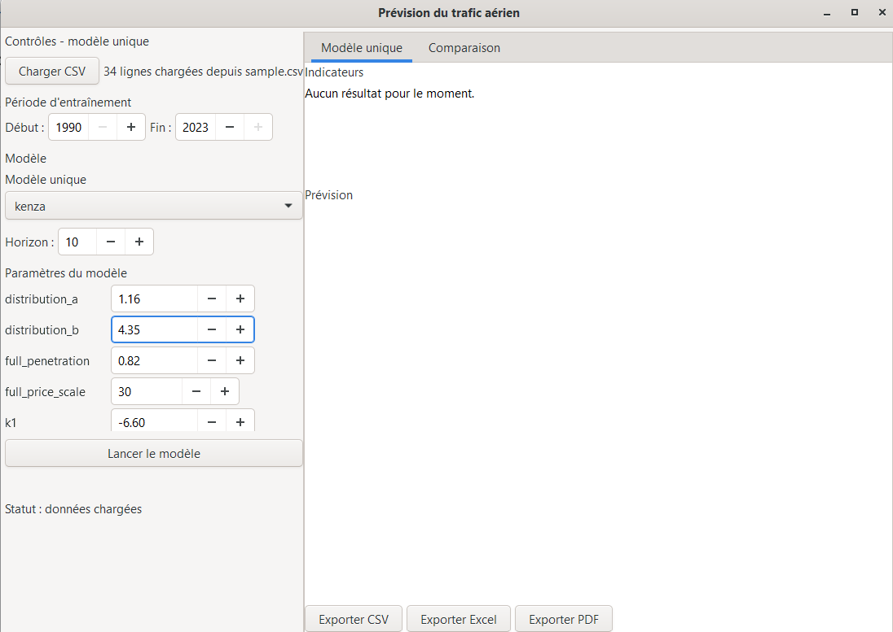
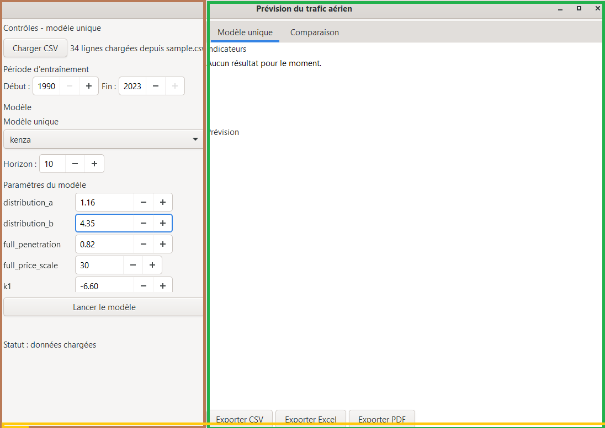
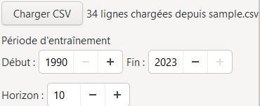
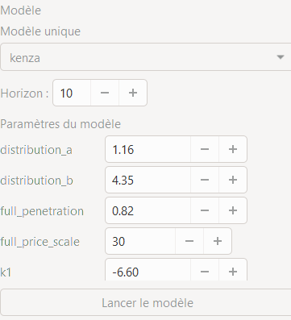
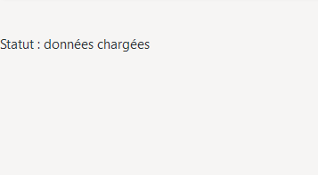
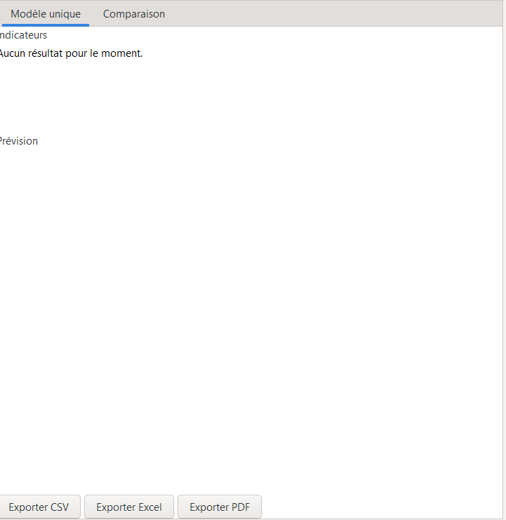
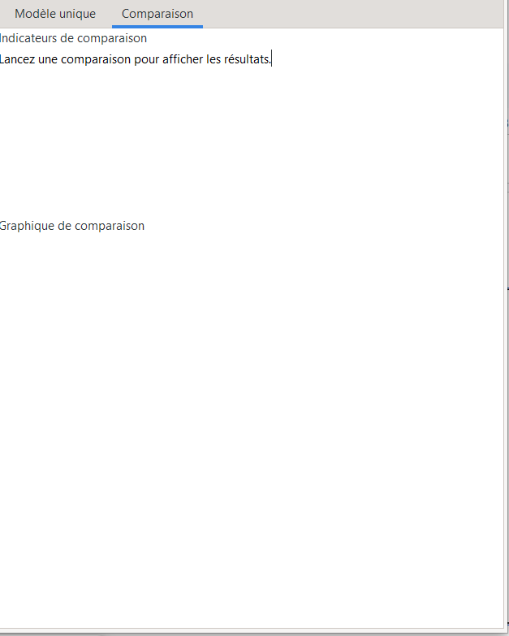

# AirTrafficForecaster — Guide utilisateur

Application de prévision du trafic aérien développée en Julia.

> Transcription Markdown de [`../Guide_utilisateur.pdf`](../Guide_utilisateur.pdf),
> exporté de Google Docs — dont la source `.docx` n'est ni dans le dépôt ni sur le Drive.
> Le PDF ne porte ni niveau de titre ni style nommé : les niveaux sont déduits
> de la taille des caractères, les tableaux des filets tracés, et les intitulés
> isolés (« Description », « Limites »…) sont mis en gras faute d'autre marque
> dans la source. Les numéros de page du sommaire imprimé sont remplacés par
> des ancres.
>
> Le fond a ensuite été **corrigé pour correspondre au code** : modèles réellement
> enregistrés, noms actuels des paramètres, nature des bandes d'incertitude, contenu réel des
> exports et contrôles réellement appliqués au chargement. Les passages concernés le disent
> explicitement.

## Sommaire

- [1. Introduction](#1-introduction)
  - [1.1 Objectif du manuel](#11-objectif-du-manuel)
  - [1.2 Présentation de l’application](#12-présentation-de-lapplication)
  - [1.3 Fonctionnalités principales](#13-fonctionnalités-principales)
- [2. Installation et lancement](#2-installation-et-lancement)
  - [2.1 Configuration requise](#21-configuration-requise)
  - [2.2 Procédure d’installation](#22-procédure-dinstallation)
  - [2.3 Lancement de l’interface graphique](#23-lancement-de-linterface-graphique)
- [3. Présentation de l’interface](#3-présentation-de-linterface)
  - [3.1 Fenêtre principale - organisation générale](#31-fenêtre-principale---organisation-générale)
  - [3.2 Panneau de contrôle (côté gauche)](#32-panneau-de-contrôle-côté-gauche)
  - [3.3 Zone de résultats (côté droit) - les deux onglets](#33-zone-de-résultats-côté-droit---les-deux-onglets)
  - [3.4 Navigation et synchronisation entre les panneaux](#34-navigation-et-synchronisation-entre-les-panneaux)
  - [3.5 En résumé : ce que vous voyez en un coup d’œil](#35-en-résumé--ce-que-vous-voyez-en-un-coup-dœil)
- [4. Chargement et préparation des données](#4-chargement-et-préparation-des-données)
  - [4.1 Formats acceptés](#41-formats-acceptés)
  - [4.2 Structure attendue des données](#42-structure-attendue-des-données)
  - [4.3 Procédure de chargement](#43-procédure-de-chargement)
  - [4.4 Sélection de la période d’entraînement](#44-sélection-de-la-période-dentraînement)
  - [4.5 Contrôles appliqués au chargement](#45-contrôles-appliqués-au-chargement)
  - [4.6 En résumé](#46-en-résumé)
- [5. Choix du modèle](#5-choix-du-modèle)
  - [5.1 Présentation des modèles disponibles](#51-présentation-des-modèles-disponibles)
  - [5.2 Sélection d’un modèle pour une prévision unique](#52-sélection-dun-modèle-pour-une-prévision-unique)
  - [5.3 Sélection de plusieurs modèles pour une comparaison](#53-sélection-de-plusieurs-modèles-pour-une-comparaison)
  - [5.4 Comprendre l’affichage des paramètres](#54-comprendre-laffichage-des-paramètres)
  - [5.5 Guide de choix rapide selon votre cas](#55-guide-de-choix-rapide-selon-votre-cas)
- [6. Paramétrage du modèle](#6-paramétrage-du-modèle)
  - [6.1 Présentation des paramètres](#61-présentation-des-paramètres)
  - [6.2 Modification des paramètres](#62-modification-des-paramètres)
  - [6.3 Paramètres communs à connaître](#63-paramètres-communs-à-connaître)
  - [6.4 Sauvegarde et persistance des paramètres](#64-sauvegarde-et-persistance-des-paramètres)
  - [6.5 En résumé](#65-en-résumé)
- [7. Lancement de la prévision](#7-lancement-de-la-prévision)
  - [7.1 Définition de l’horizon de prévision](#71-définition-de-lhorizon-de-prévision)
  - [7.2 Lancement d’une prévision avec un modèle unique](#72-lancement-dune-prévision-avec-un-modèle-unique)
  - [7.3 Lancement d’une comparaison de modèles](#73-lancement-dune-comparaison-de-modèles)
  - [7.4 Interprétation des résultats affichés](#74-interprétation-des-résultats-affichés)
  - [7.5 En résumé : déroulement d’une prévision](#75-en-résumé--déroulement-dune-prévision)
- [8. Interprétation des résultats](#8-interprétation-des-résultats)
  - [8.1 Onglet « Modèle unique » : lecture détaillée](#81-onglet--modèle-unique---lecture-détaillée)
  - [8.2 Onglet « Comparaison » : lecture du tableau et du graphique](#82-onglet--comparaison---lecture-du-tableau-et-du-graphique)
  - [8.3 Indicateurs de continuité (diagnostic)](#83-indicateurs-de-continuité-diagnostic)
  - [8.4 Intervalles - comprendre ce que mesure la bande](#84-intervalles---comprendre-ce-que-mesure-la-bande)
  - [8.5 Synthèse et prise de décision](#85-synthèse-et-prise-de-décision)
  - [8.6 En résumé](#86-en-résumé)
- [9. Export des résultats](#9-export-des-résultats)
  - [9.1 Présentation des formats d’export](#91-présentation-des-formats-dexport)
  - [9.2 Export au format CSV](#92-export-au-format-csv)
  - [9.3 Export au format Excel](#93-export-au-format-excel)
  - [9.4 Export au format PDF](#94-export-au-format-pdf)
  - [9.5 Récupérer le graphique dans un autre format](#95-récupérer-le-graphique-dans-un-autre-format)
  - [9.6 Conseils et bonnes pratiques](#96-conseils-et-bonnes-pratiques)
  - [9.7 Que faire si l’export échoue ?](#97-que-faire-si-lexport-échoue-)
  - [9.8 En résumé](#98-en-résumé)
- [10. Dépannage et bonnes pratiques](#10-dépannage-et-bonnes-pratiques)
  - [10.1 Problèmes fréquents et solutions](#101-problèmes-fréquents-et-solutions)
  - [10.2 Bonnes pratiques pour des prévisions fiables](#102-bonnes-pratiques-pour-des-prévisions-fiables)
  - [10.3 Trucs et astuces pour le paramétrage fin](#103-trucs-et-astuces-pour-le-paramétrage-fin)
  - [10.4 Support et ressources complémentaires](#104-support-et-ressources-complémentaires)
  - [10.5 En résumé - Checklist avant de lancer une prévision](#105-en-résumé---checklist-avant-de-lancer-une-prévision)
- [11. Annexe : Description des modèles](#11-annexe--description-des-modèles)
  - [11.1 Tableau récapitulatif des modèles](#111-tableau-récapitulatif-des-modèles)
  - [11.2 Détail de chaque modèle](#112-détail-de-chaque-modèle)
  - [11.3 Guide de choix selon les données disponibles](#113-guide-de-choix-selon-les-données-disponibles)
  - [11.4 Glossaire des paramètres (aide-mémoire)](#114-glossaire-des-paramètres-aide-mémoire)

## 1. Introduction

### 1.1 Objectif du manuel

Ce manuel s’adresse à toute personne souhaitant utiliser l’application AirTrafficForecaster pour réaliser des prévisions de trafic aérien. Il est conçu pour des utilisateurs ayant une connaissance minimale de l’économétrie et une pratique courante des interfaces graphiques. Aucune compétence en programmation Julia n’est requise pour suivre les procédures décrites. Vous y trouverez :

- les étapes d’installation et de lancement ;
- la description complète de l’interface ;
- la méthode pour charger des données, choisir un modèle, paramétrer et lancer une prévision ;
- les explications pour interpréter les résultats et les exporter ;
- des conseils pratiques pour éviter les erreurs courantes.

### 1.2 Présentation de l’application

AirTrafficForecaster est une plateforme de prévision du trafic aérien développée en Julia. Elle implémente une famille de modèles économétriques inspirés de l’approche Kenza, qui relie la demande de transport aérien à des variables macroéconomiques fondamentales :

- Population du territoire concerné ;
- PIB par habitant (indicateur de richesse) ;
- Prix du billet d’avion ;
- Distribution des revenus (modélisée par une courbe).

L’application permet de :

- charger vos propres données historiques (au format CSV ou Excel) ;
- choisir parmi cinq variantes du modèle Kenza (complète, linéaire, combinée, indexées) ;
- ajuster les paramètres du modèle ou les laisser par défaut ;
- lancer une prévision sur un horizon personnalisé ;
- comparer les performances de plusieurs modèles sur un même jeu de données ;
- exporter les résultats sous forme de tableaux (CSV, Excel) et de rapports complets (PDF).

L’outil a été conçu pour être à la fois pédagogique et opérationnel. Il convient aussi bien à des études de cas académiques qu’à des exercices de planification stratégique dans le secteur du transport aérien.

### 1.3 Fonctionnalités principales

**Fonctionnalité - Chargement de données**

Description : Import de fichiers CSV ou Excel, avec validation automatique des colonnes et nettoyage des valeurs aberrantes.

**Fonctionnalité - Modèles Kenza**

Description : Sélection parmi cinq modèles (complet, simplifié, combiné, et deux variantes indexées). Chaque modèle est décrit avec ses paramètres et son domaine de pertinence.

**Fonctionnalité - Paramétrage interactif**

Description : Modification des paramètres via des contrôles graphiques (cases à cocher, curseurs, champs de texte) ou en édition JSON directe.

**Fonctionnalité - Prévision unique**

Description : Calibration sur la période d’entraînement choisie, génération d’une prévision avec intervalle de confiance, affichage des métriques de performance.

**Fonctionnalité - Comparaison de modèles**

Description : Sélection simultanée de plusieurs modèles ; tableau comparatif des métriques et graphique superposé.

**Fonctionnalité - Export**

Description : Sauvegarde des prévisions en CSV, Excel (multi-onglets) ou PDF (rapport structuré avec graphique et diagnostics).

## 2. Installation et lancement

Cette section décrit l’installation d’AirTrafficForecaster et le premier lancement de l’interface graphique. Les opérations indiquées ne nécessitent aucune connaissance avancée en programmation Julia.

### 2.1 Configuration requise

Avant de commencer, assurez-vous que votre machine répond aux prérequis suivants :

**Élément - Système d’exploitation**

Exigence : Windows 10/11, macOS 9.15 (Catalina) ou supérieur, ou une distribution Linux récente (Ubuntu 20.04+, Debian 11+, etc.)

**Élément - Julia**

Exigence : Version 1.6 ou supérieure (testée avec les versions 1.9 et 1.12). Télécharger Julia

**Élément - Espace disque**

Exigence : Environ 500 Mo (pour Julia, les dépendances et l’application)

**Élément - Mémoire vive**

Exigence : 4 Go minimum

**Élément - Réseau**

Exigence : Connexion Internet nécessaire pour la première installation (téléchargement des dépendances)

Remarque pour Linux : L’interface graphique utilise GTK3. Si vous rencontrez des problèmes à l’ouverture, installez les bibliothèques système avec la commande sudo apt install libgtk-3-dev (Ubuntu/Debian) ou l’équivalent pour votre distribution. Sur Windows et macOS, `Gtk.jl` télécharge automatiquement les dépendances nécessaires.

### 2.2 Procédure d’installation

Exécutez les étapes suivantes dans l’ordre. Les manipulations en ligne de commande restent limitées aux commandes indiquées.

#### Étape 1 - Récupérer le projet

- Avec Git (recommandé) : ouvrez un terminal (ou cmd sous Windows) et tapez :

```bash
git clone https://github.com/ChamaELKHEMSANI/Evolutionary-Algoritms-Forcast.git
cd AirTrafficForecaster
```

(remplacez <url-du-depot> par l’adresse fournie par votre équipe)

- Sans Git : téléchargez le dossier du projet au format ZIP depuis le dépôt, puis décompressez-le. Ouvrez un terminal et placez-vous dans le dossier décompressé :

```
cd chemin/vers/AirTrafficForecaster
```

##### Étape 2 - Lancer Julia

Dans le même terminal, tapez :

```bash
julia
```

Vous voyez alors l’invite Julia (julia>). C’est le signe que le langage est actif.

##### Étape 3 - Activer l’environnement du projet

L’application utilise un environnement dédié qui liste toutes les bibliothèques (paquets) nécessaires. Pour l’activer, tapez :

```julia
import Pkg
Pkg.activate(".")
```

Le message indique désormais (AirTrafficForecaster) pkg> si vous êtes dans le bon dossier.

##### Étape 4 - Installer les dépendances

Toujours dans la même session Julia, tapez :

```julia
Pkg.instantiate()
```

Cette commande télécharge et installe automatiquement tous les paquets requis (DataFrames, Gtk, Plots, XLSX, etc.). Selon votre connexion et votre machine, cela peut prendre de 2 à 5 minutes. Ne coupez pas l’alimentation pendant ce processus.

##### Étape 5 - Quitter Julia (pour l’instant)

Une fois l’installation terminée, tapez :

```julia
exit()
```

Vous revenez au terminal classique.

### 2.3 Lancement de l’interface graphique

#### Méthode A - Lancement depuis le terminal (recommandé)

1. Placez-vous dans le dossier racine du projet (si ce n’est pas déjà fait) :

```bash
cd chemin/vers/AirTrafficForecaster
```

2. Lancez l’interface avec Julia :

```bash
julia gui.jl
```

3. Après quelques secondes de chargement (précompilation), la fenêtre principale apparaît.

#### Méthode B - Lancement depuis Julia (si vous êtes déjà dans une session)

1. Ouvrez Julia dans le dossier du projet.

2. Tapez :

```julia
include("gui.jl")
```

#### Que faire si la fenêtre ne s’affiche pas ?

- Vérifiez que vous êtes bien dans le bon répertoire.
- Sur Linux, assurez-vous que GTK3 est installé (voir section 2.1).
- Sur macOS, si un message concerne l’affichage, essayez de définir la variable d’environnement GKSwstype (le code le fait automatiquement, mais en cas de souci, exécutez `ENV["GKSwstype"] = "100"` avant include).
- Si une erreur mentionne un paquet manquant, relancez `Pkg.instantiate()` dans le dossier du projet.

#### Premier démarrage - précompilation

Lors du tout premier lancement, Julia compile une partie du code pour l’adapter à votre machine. Cela peut prendre 30 secondes à 1 minute. Les lancements suivants seront beaucoup plus rapides (quelques secondes). Une fois la fenêtre ouverte, vous êtes prêt à commencer : le panneau de gauche vous propose de charger des données, et le panneau de droite affiche les résultats. Passez au chapitre suivant pour découvrir l’interface en détail.



*Figure 2 - Fenêtre principale de l’application fraîchement lancée, avec le panneau de gauche (contrôles) et le panneau de droite (onglets vides).*

Résumé des commandes pour une installation rapide (copier-coller) :

```bash
git clone <url>
cd AirTrafficForecaster
julia
import Pkg; Pkg.activate("."); Pkg.instantiate()
exit()
julia gui.jl
```

## 3. Présentation de l’interface

Cette section présente la fenêtre principale d’AirTrafficForecaster. Elle décrit chaque zone, bouton et onglet afin de permettre un repérage direct des contrôles et des résultats.

### 3.1 Fenêtre principale - organisation générale

Lorsque vous lancez `gui.jl`, une fenêtre unique s’ouvre, divisée en deux grandes zones :

- Panneau gauche (environ 30 % de la largeur) : il regroupe tous les contrôles pour charger les données, choisir le modèle, régler les paramètres et lancer les calculs.
- Panneau droit (environ 70 % de la largeur) : il affiche les résultats sous forme de texte et de graphiques, dans deux onglets.

Un bandeau de statut en bas du panneau gauche vous tient informé des actions en cours (chargement, calcul, erreur éventuelle). Conseil : vous pouvez ajuster la largeur relative des deux panneaux en faisant glisser la séparation verticale avec la souris.



*Figure 3 - Vue globale de la fenêtre avec des étiquettes indiquant « Panneau de contrôle », « Zone de résultats » et « Barre d’état ».*

### 3.2 Panneau de contrôle (côté gauche)

Le panneau de gauche est organisé en sections verticales. Nous les décrivons de haut en bas.

#### 3.2.1 Chargement des données

- Bouton « Charger CSV » : ouvre une boîte de dialogue pour sélectionner votre fichier de données (CSV ou Excel).
- Étiquette d’état : une fois le fichier chargé, elle affiche le nombre de lignes et le nom du fichier (ex. « 34 lignes chargées depuis `sample.csv` »).

#### 3.2.2 Période d’entraînement

Deux champs numériques (spin boxes) permettent de sélectionner l’année de début et l’année de fin des données utilisées pour calibrer le modèle.

- Par défaut, ils couvrent toute la plage disponible.
- Vous pouvez restreindre l’entraînement à une sous-période (par exemple, exclure les années de crise) en modifiant ces valeurs.

#### 3.2.3 Choix du modèle

Cette zone change selon l’onglet actif (détail au § 3.3).

- Onglet « Modèle unique » : une simple liste déroulante pour sélectionner le modèle à utiliser.
- Onglet « Comparaison » : une liste de cases à cocher pour activer plusieurs modèles simultanément, ainsi qu’une seconde liste déroulante pour choisir quel modèle afficher dans la zone de paramètres (juste en dessous).

#### 3.2.4 Horizon de prévision

Un champ numérique intitulé « Horizon » vous permet de définir le nombre d’années à prévoir (de 1 à 30 ans). La valeur par défaut est 9.

#### 3.2.5 Paramètres du modèle

Cette section regroupe les paramètres techniques du modèle.

- Une zone déroulante (scrolled window) affiche la liste des paramètres du modèle sélectionné.
- Pour chaque paramètre, un contrôle adapté est généré automatiquement :
  - Case à cocher pour les valeurs vraies/fausses (ex. `optimize_parameters`).
  - Curseur numérique (spin button) pour les nombres entiers ou décimaux.
  - Zone de texte pour les chaînes de caractères, les listes ou les objets JSON complexes.
- Vous pouvez ainsi modifier les paramètres à la volée, sans écrire une ligne de code.
- Le libellé au-dessus de la zone change dynamiquement (« Paramètres du modèle » ou « Paramètres de [nom du modèle] ») selon le contexte.

#### 3.2.6 Boutons d’action

- « Lancer le modèle » : exécute la prévision avec le modèle unique sélectionné.
- « Lancer la comparaison » : exécute la prévision pour tous les modèles cochés.

Ces deux boutons sont visibles en fonction de l’onglet actif (seul l’un des deux est utilisable à la fois).

#### 3.2.7 Barre de statut

Tout en bas, une étiquette indique l’état courant :

- « Statut : prêt » au démarrage.
- « Statut : données chargées » après import.
- « Statut : prévision terminée » après un calcul réussi.
- « Erreur : … » en cas de problème (avec un message explicite).



*Figure 4 - Partie haute du panneau gauche (chargement, période, horizon).*



*Figure 5 - Partie milieu (choix du modèle et paramètres).*



*Figure 6 - Partie basse (barre de statut).*

### 3.3 Zone de résultats (côté droit) - les deux onglets

Le panneau droit est organisé en deux onglets accessibles par des clics sur leurs libellés : « Modèle unique » et « Comparaison ». Chaque onglet est dédié à un mode de travail.

#### 3.3.1 Onglet « Modèle unique »

Cet onglet s’affiche par défaut et contient trois parties :

1. Indicateurs de performance (en haut) : une zone de texte qui liste les métriques du modèle calibré :

  - RMSE (erreur quadratique moyenne)
  - MAE (erreur absolue moyenne)
  - R² (coefficient de détermination)
  - MAPE (erreur relative moyenne en %) Ces valeurs vous permettent d’évaluer la qualité de l’ajustement sur la période d’entraînement. 2. Graphique de prévision (au centre) :
  - Courbe bleue avec points : l’historique réel des passagers.
  - Courbe rouge en pointillés : la prévision générée.
  - Zone grisée (si disponible) : l’intervalle de confiance à 95 % autour de la prévision.
  - Les axes sont automatiquement étiquetés (Année / Passagers). 3. Boutons d’export (en bas) : trois boutons pour enregistrer les résultats :
  - « Exporter CSV »
  - « Exporter Excel »
  - « Exporter PDF »

#### 3.3.2 Onglet « Comparaison »

Cet onglet s’active lorsque vous souhaitez confronter plusieurs modèles. Il contient :

1. Tableau comparatif des métriques (en haut) : un tableau texte avec une ligne par modèle et des colonnes pour RMSE, MAE, R² et MAPE. Cela permet de repérer rapidement le modèle le plus performant.

2. Graphique superposé (au centre) :

  - L’historique réel est affiché en noir (pour référence).
  - Chaque modèle sélectionné est tracé avec une couleur différente (rouge, bleu, vert, etc.) en pointillés.
  - La légende identifie chaque courbe.
  - Ce graphique facilite la comparaison visuelle des trajectoires futures selon les hypothèses de chaque modèle.



*Figure 7 - Vue de l’onglet « Modèle unique » avec les métriques et le graphique.*



*Figure 8 - Vue de l’onglet « Comparaison » avec le tableau comparatif.*

### 3.4 Navigation et synchronisation entre les panneaux

Un mécanisme intelligent relie le panneau gauche et les onglets de droite :

- Lorsque vous cliquez sur l’onglet « Modèle unique » :
  - Le panneau gauche affiche la liste déroulante des modèles (choix unique).
  - Le bouton « Lancer le modèle » devient actif.
  - Les paramètres affichés sont ceux du modèle sélectionné dans la liste.
- Lorsque vous cliquez sur l’onglet « Comparaison » :
  - Le panneau gauche affiche les cases à cocher pour sélectionner plusieurs modèles.
  - Une liste déroulante supplémentaire permet de choisir le modèle dont on souhaite voir les paramètres (par défaut, le premier de la liste).
  - Le bouton « Lancer la comparaison » devient actif.

Cette synchronisation évite toute confusion et vous permet de basculer facilement entre les deux modes de travail sans perdre vos réglages.

### 3.5 En résumé : ce que vous voyez en un coup d’œil

**Zone - Gauche - haut**

Contenu : Chargement des données et sélection de la période

**Zone - Gauche - milieu**

Contenu : Choix du modèle (unique ou multiple) et paramètres

**Zone - Gauche - bas**

Contenu : Horizon, bouton d’exécution, barre de statut

**Zone - Droite - onglet unique**

Contenu : Métriques, graphique individuel, boutons d’export

**Zone - Droite - onglet comparaison**

Contenu : Tableau comparatif, graphique superposé

## 4. Chargement et préparation des données

Cette section vous explique comment importer vos propres données dans l’application et les préparer pour la prévision. La qualité des prévisions dépend en grande partie de la qualité des données historiques : prenez le temps de bien comprendre les formats et les colonnes attendues.

### 4.1 Formats acceptés

L’application accepte deux formats de fichiers :

*Tableau 1 - Formats de données acceptés*

| Format | Extension | Particularités |
| --- | --- | --- |
| CSV | .csv | Fichier texte où les colonnes sont séparées par un séparateur (virgule ou point-virgule). L’application détecte automatiquement le séparateur. |
| Excel | .xlsx ou .xls | Fichier Excel classique. L’application lit la première feuille du classeur. |

Remarque : si votre fichier CSV utilise le point-virgule (;) comme séparateur (format français courant), l’application le reconnaît automatiquement et l’importe correctement.

### 4.2 Structure attendue des données

Pour que les modèles fonctionnent correctement, votre fichier doit contenir certaines colonnes. L’application est conçue pour être tolérante : elle reconnaît plusieurs variantes de noms de colonnes et les normalise automatiquement (ex. « passagers » devient « `actual_passengers` »).

#### 4.2.1 Colonnes obligatoires

Deux colonnes sont absolument indispensables :

**Nom attendu - year**

**Autres noms reconnus : annee, date, t**

Description : Année de l’observation (entier, ex. 1990, 2005, 2023).

**Nom attendu - `actual_passengers` **

Autres noms reconnus : passagers, passengers, traffic, volume, y

Description : Nombre réel de passagers transportés (entier ou décimal).

Si l’une de ces colonnes est manquante, l’application affiche une erreur et vous invite à corriger votre fichier.

#### 4.2.2 Colonnes recommandées (pour les modèles avancés)

Les modèles Kenza utilisent des variables macroéconomiques pour expliquer la demande. Bien que certains modèles simplifiés puissent fonctionner avec un sous-ensemble, il est vivement conseillé de fournir au moins :

**Nom attendu - population**

**Autres noms reconnus : pop, `pop_total` **

Description : Population totale du territoire étudié.

**Nom attendu - `gdp_per_capita` **

**Autres noms reconnus : gdp, pib, income**

Description : PIB par habitant (en monnaie locale, constant ou courant selon votre choix).

**Nom attendu - `ticket_price` **

**Autres noms reconnus : price, prix, fare**

Description : Prix moyen du billet d’avion (dans la même monnaie que le PIB).

#### 4.2.3 Colonnes optionnelles

Vous pouvez ajouter d’autres colonnes (ex. `fuel_price`, route) : elles seront ignorées par les modèles mais conservées dans les exports.

#### 4.2.4 Exemple de fichier valide

Voici un extrait de fichier CSV conforme (les séparateurs sont des points-virgules, mais les virgules fonctionnent aussi) :

**csv**

**year;population;`gdp_per_capita`;`ticket_price`;`actual_passengers` **

1990;6996986;28635.66;185.00;31000 1991;7067396;28230.97;188.50;32000 1992;7110010;28446.47;192.00;33500 ... Conseil : l’application fournit un fichier d’exemple (data/`sample.csv`) qui est automatiquement chargé au démarrage. Vous pouvez vous en inspirer pour formater vos propres données.

### 4.3 Procédure de chargement

L’importation des données se fait en quelques clics :

1. Ouvrir l’application (voir chapitre 2).

2. Cliquer sur le bouton « Charger CSV » situé en haut du panneau de gauche.

3. Sélectionner votre fichier dans la boîte de dialogue qui s’ouvre :

  - Naviguez jusqu’au dossier contenant votre fichier.
  - Choisissez le fichier (.csv, .xlsx ou .xls).
  - Cliquez sur « Ouvrir » (ou « Open »). 4. Attendre le traitement : l’application lit le fichier, normalise les noms de colonnes et effectue une validation automatique (voir § 4.5). Ce traitement est quasi instantané pour des fichiers de quelques milliers de lignes. 5. Vérifier le message de confirmation : l’étiquette sous le bouton de chargement change et affiche le nombre de lignes chargées, par exemple : « 34 lignes chargées depuis `sample.csv` ». La barre de statut en bas du panneau indique « Statut : données chargées ».

#### Que faire en cas d’erreur ?

**Message d’erreur - « Missing required columns: year »**

Cause probable : La colonne des années n’est pas reconnue.

Solution : Renommez votre colonne en year (ou annee, date).

**Message d’erreur - « Missing required columns: `actual_passengers` »**

Cause probable : La colonne des passagers n’est pas reconnue.

Solution : Renommez-la en `actual_passengers` (ou passagers, traffic).

**Message d’erreur - « Unsupported file type »**

Cause probable : Le fichier n’est ni CSV ni Excel.

Solution : Convertissez votre fichier en CSV ou Excel.

**Message d’erreur - « Negative passenger values found »**

Cause probable : Des valeurs négatives apparaissent dans la colonne des passagers.

Solution : Corrigez les données (les passagers ne peuvent pas être négatifs).

**Message d’erreur - « Duplicate years found »**

Cause probable : La même année apparaît plusieurs fois.

Solution : Supprimez les doublons ou corrigez vos données.

### 4.4 Sélection de la période d’entraînement

Une fois les données chargées, vous pouvez choisir la plage d’années qui servira à calibrer le modèle. Par défaut, toutes les années disponibles sont utilisées, mais il peut être utile de restreindre la période pour :

- exclure des années atypiques (ex. 2020, année de crise sanitaire) ;
- tester la robustesse du modèle sur une sous-période ;
- simuler un entraînement sur le passé récent uniquement.

#### Comment modifier la période ?

1. Dans le panneau de gauche, repérez la section « Période d’entraînement ».

2. Deux champs numériques sont disponibles :

  - « Début : » (spin button) : année de début de la période.
  - « Fin : » (spin button) : année de fin de la période. 3. Utilisez les flèches haut/bas ou saisissez directement une année dans chaque champ. 4. Les bornes minimales et maximales sont automatiquement calquées sur les années présentes dans vos données.

Attention : l’année de début doit être inférieure ou égale à l’année de fin. Si vous saisissez une combinaison invalide, un message d’erreur s’affiche.

#### Quelques cas d’usage courants

**Objectif - Prévision à long terme (10+ ans)**

Période recommandée : Toute la série historique disponible.

**Objectif - Prévision à court terme (1-3 ans)**

Période recommandée : Les 5 à 10 dernières années (pour capter les tendances récentes).

**Objectif - Test de robustesse**

Période recommandée : Comparer les résultats avec une période « normale » et une période « avec crise » (ex. exclure 2020).

Conseil : si vous modifiez la période après avoir déjà lancé une prévision, relancez le calcul : les métriques et le graphique seront mis à jour pour refléter la nouvelle plage d’entraînement.

### 4.5 Contrôles appliqués au chargement

L'application ne modifie pas vos données. Elle les normalise, les contrôle, et **refuse le
fichier** si un défaut bloquant est détecté. Aucune valeur n'est inventée à votre place.

#### 4.5.1 Normalisation des noms de colonnes

Les noms sont mis en minuscules, débarrassés des espaces de début et de fin, puis traduits
selon une table de synonymes :

| Vous écrivez | L'application retient |
| --- | --- |
| `year`, `annee`, `date`, `t` | `year` |
| `passagers`, `passengers`, `traffic`, `volume`, `y` | `actual_passengers` |
| `population`, `pop`, `pop_total` | `population` |
| `gdp`, `pib`, `income` | `gdp_per_capita` |
| `price`, `prix`, `fare` | `ticket_price` |

Les accents ne sont **pas** supprimés : `année` n'est pas reconnu, `annee` l'est. Si deux
colonnes aboutissent au même nom, la seconde reçoit un suffixe (`population_2`).

#### 4.5.2 Conversion du type de l'année

Si la colonne `year` contient des nombres entiers écrits comme des décimaux (2005.0), elle
est convertie en entiers. La conversion est abandonnée sans bruit si une valeur manque ou
n'est pas un entier — le contrôle suivant signalera alors le problème.

#### 4.5.3 Contrôles bloquants

Le fichier est **refusé**, avec un message nommant la colonne en cause, dans ces cas :

- une colonne obligatoire manque (`year` ou `actual_passengers`) ;
- `year` ou `actual_passengers` comporte au moins une valeur vide ;
- `year` contient autre chose que des entiers ;
- une même année apparaît deux fois ;
- un nombre de passagers est négatif.

Une valeur manquante dans `actual_passengers` est bloquante et non comblée : le modèle
n'aurait aucun moyen honnête de deviner un trafic non observé.

#### 4.5.4 Avertissements non bloquants

Les valeurs extrêmes sont **signalées, jamais corrigées**. Une colonne dont des valeurs
sortent de l'intervalle [Q1 − 3×IQR ; Q3 + 3×IQR] produit un avertissement du type
« Column '`ticket_price`' has 3 potential outliers ». La colonne `year` en est exemptée :
elle est monotone par construction. `actual_passengers` **n'en est pas exemptée**, mais ses
valeurs ne sont pas écrêtées pour autant : les chocs de 2009 et 2020 sont des faits que le
modèle doit reproduire, pas des anomalies de saisie.

Ces avertissements figurent dans le rapport de validation. L'interface graphique n'affiche
aujourd'hui que les messages bloquants dans la barre d'état.

#### 4.5.5 Ce qui n'est pas fait

Contrairement à ce que l'on pourrait attendre, l'application **ne** remplace **pas** les
valeurs manquantes par la médiane, **n**'écrête **pas** les valeurs aberrantes et **ne**
supprime **pas** les lignes en double. Une fonction `clean_data` faisant tout cela existe
bien dans `julia/services/data_service.jl`, mais aucun appelant ne l'utilise : elle n'a
jamais d'effet sur vos données. Corrigez vos fichiers à la source.

### 4.6 En résumé

#### Étape 1 - Préparer votre fichier

Résultat attendu : Colonnes year et `actual_passengers` présentes, idéalement population,

```
gdp_per_capita, ticket_price.
```

##### Étape 2 - Cliquer sur « Charger CSV »

Résultat attendu : Sélectionner le fichier dans la boîte de dialogue.

##### Étape 3 - Vérifier le message de confirmation

Résultat attendu : L’étiquette affiche le nombre de lignes chargées.

##### Étape 4 - Ajuster la période d’entraînement

Résultat attendu : Définir les années de début et de fin (optionnel).

##### Étape 5 - Lancer la prévision (chapitre 7)

Résultat attendu : Les données sont propres et prêtes à être utilisées.

## 5. Choix du modèle

Le cœur de l’application réside dans le choix du modèle de prévision. Chaque modèle repose sur la même famille Kenza mais avec des hypothèses et des complexités différentes. Ce chapitre vous présente les modèles disponibles et vous guide pour sélectionner celui qui correspond le mieux à vos besoins et à vos données.

### 5.1 Présentation des modèles disponibles

L’application propose cinq modèles, tous accessibles depuis l’interface. Le tableau ci-dessous résume leurs caractéristiques pour vous aider à faire un premier choix.

| Nom affiché | Clé technique | Type | Variables nécessaires | Idéal pour… |
| --- | --- | --- | --- | --- |
| Kenza Econometric | kenza | complète | population, PIB/hab., prix du billet | Prévisions à long terme (5+ ans) avec une approche économétrique complète. |
| Kenza Simplifie | kenza_simplifie | Linéaire | population, PIB/hab., prix du billet | Prévisions court à moyen terme (1-5 ans), approche pédagogique et rapide. |
| Kenza Simplifie Combine | kenza_simplifie_combine | Linéaire mixte (tendance + élasticité) | population, PIB/hab., prix du billet | Compromis entre tendance historique et sensibilité économique. |
| Kenza Simplifie Indexe | kenza_simplifie_indexe | Linéaire indexée | population, PIB/hab. (pas de prix) | Cas où le prix du billet est indisponible ou peu fiable. |
| Kenza Indexed | kenza_indexed | indexée | population, PIB/hab. (pas de prix) | Version non-linéaire sans prix, plus proche de l’esprit Kenza original. |

> **`kenza_probabilistic` n'est pas disponible.** Le code du modèle existe dans
> `julia/models/kenza_models.jl`, mais il n'est volontairement pas enregistré dans le
> registre : il n'apparaît donc ni dans la liste déroulante, ni dans la comparaison, ni
> dans `run/test.jl`. En l'état il emprunte l'indice normalisé de Kenza Indexed sans en
> calibrer les deux constantes, ce qui fausse son niveau d'un facteur 0,24 à 2,4 selon le
> jeu de données ; son bootstrap de paramètres reste par ailleurs inerte tant que
> `optimize_parameters` vaut `false`, c'est-à-dire par défaut. Le remettre en service
> suppose d'abord de calibrer son facteur d'échelle.

Conseil : si vous débutez, commencez par Kenza Simplifie : il est rapide, interprétable et donne de bons résultats sur des horizons moyens. Puis explorez les autres modèles pour affiner votre analyse.

### 5.2 Sélection d’un modèle pour une prévision unique

Lorsque vous travaillez dans l’onglet « Modèle unique » (par défaut), vous choisissez un seul modèle à la fois. Voici la procédure :

#### Étape 1 - Vérifier que vous êtes dans le bon onglet

- Cliquez sur l’onglet « Modèle unique » dans le panneau de droite si ce n’est pas déjà fait.
- Le panneau de gauche affiche alors une liste déroulante intitulée « Modèle » (ou « Modèle unique »).

##### Étape 2 - Ouvrir la liste déroulante

- Cliquez sur la flèche vers le bas à droite du champ.
- Tous les modèles disponibles apparaissent dans l’ordre alphabétique (par leur nom technique).

##### Étape 3 - Choisir un modèle

- Cliquez sur le nom du modèle souhaité (par exemple, « `kenza_simplifie` »).
- La sélection se fait instantanément.

##### Étape 4 - Vérifier les paramètres affichés

- Juste en dessous, la zone « Paramètres du modèle » se met à jour automatiquement pour afficher les paramètres du modèle que vous venez de sélectionner.
- Vous pouvez alors ajuster ces paramètres si nécessaire (voir chapitre 6).

##### Étape 5 - Lancer la prévision

- Une fois le modèle choisi et éventuellement paramétré, vous pouvez cliquer sur « Lancer le modèle » (voir chapitre 7).

Remarque : si vous modifiez le modèle après avoir déjà lancé une prévision, les résultats précédents restent affichés. Il vous faudra relancer le calcul pour obtenir la nouvelle prévision.

### 5.3 Sélection de plusieurs modèles pour une comparaison

Lorsque vous basculez dans l’onglet « Comparaison », vous pouvez activer simultanément plusieurs modèles. Cela est très utile pour :

- comparer les performances respectives sur les données historiques (métriques) ;
- visualiser les trajectoires futures divergentes ;
- choisir le modèle le plus robuste pour votre cas.

#### Étape 1 - Passer à l’onglet « Comparaison »

- Cliquez sur l’onglet « Comparaison » dans le panneau de droite.
- Le panneau de gauche change automatiquement : la liste déroulante unique est remplacée par :
  - une liste de cases à cocher (une par modèle) ;
  - une liste déroulante secondaire intitulée « Paramètres du modèle : ».

##### Étape 2 - Cocher les modèles à comparer

- Par défaut, trois modèles sont pré-cochés : `kenza`, `kenza_simplifie` et

```
kenza_simplifie_indexe.
```

- Pour ajouter ou retirer un modèle, il suffit de cliquer sur la case à cocher correspondante.
- Vous pouvez cocher autant de modèles que vous le souhaitez (il n’y a pas de limite).

##### Étape 3 - Choisir le modèle dont vous voulez voir les paramètres

- La liste déroulante « Paramètres du modèle : » vous permet de sélectionner quel modèle afficher dans la zone des paramètres (en dessous).
- Cela vous évite de chercher un paramètre spécifique dans une longue liste : vous pouvez modifier les paramètres de chaque modèle un par un.

##### Étape 4 - Modifier les paramètres (optionnel)

- Sélectionnez un modèle dans la liste déroulante secondaire.
- Ajustez ses paramètres dans la zone dédiée (comme pour le mode unique).
- Répétez l’opération pour chaque modèle que vous souhaitez paramétrer différemment.

##### Étape 5 - Lancer la comparaison

- Cliquez sur « Lancer la comparaison ».
- L’application exécute successivement tous les modèles cochés et affiche les résultats dans l’onglet « Comparaison » (tableau et graphique superposé).

Conseil : pour une comparaison équitable, veillez à conserver les mêmes hypothèses macroéconomiques (taux de croissance du PIB, de la population, etc.) pour tous les modèles. Ces paramètres sont généralement communs (ex. `gdp_growth_rate`, `population_growth_rate`) et se retrouvent dans chaque modèle.

### 5.4 Comprendre l’affichage des paramètres

Que vous soyez en mode unique ou en comparaison, la zone des paramètres réagit toujours au modèle sélectionné dans la liste déroulante active :

- En mode unique : la liste déroulante principale détermine à la fois le modèle qui sera exécuté et les paramètres affichés.
- En mode comparaison : la liste déroulante secondaire détermine uniquement les paramètres affichés ; l’exécution concerne tous les modèles cochés.

Cela peut prêter à confusion au début, mais retenez cette règle simple : Le libellé au-dessus de la zone des paramètres vous indique toujours quel modèle est en train d’être édité.

  - S’il écrit « Paramètres du modèle », c’est le modèle sélectionné dans la liste principale (mode

unique).

  - S’il écrit « Paramètres de `kenza_simplifie` » (par exemple), c’est le modèle sélectionné dans la

liste secondaire (mode comparaison).

### 5.5 Guide de choix rapide selon votre cas

Pour vous aider à choisir le modèle le plus adapté, voici quelques cas d’usage typiques :

**Votre situation - Vous avez des données complètes (population, PIB, prix) et vous voulez une**

**prévision à 10 ans.**

**Modèle recommandé : Kenza Econometric**

Raison : Modèle le plus complet, avec une distribution des revenus.

**Votre situation - Vous voulez expliquer simplement vos résultats à un public non technique.**

**Modèle recommandé : Kenza Simplifie**

Raison : Relation linéaire claire entre prix relatif et demande.

**Votre situation - Vos données de prix sont suspectes ou manquantes.**

Modèle recommandé : Kenza Simplifie Indexe ou Kenza Indexed

Raison : Fonctionne sans prix, en utilisant l’évolution du PIB comme proxy.

**Votre situation - Vous voulez mesurer l’incertitude de votre prévision (fourchette haute/basse).**

**Modèle recommandé : Kenza Econometric, avec `monte_carlo_simulations` > 0**

Raison : c'est la seule combinaison qui produise autre chose que le forfait ±20 % — un intervalle à 95 % fondé sur l'écart-type des résidus d'ajustement (voir § 8.4). Les autres modèles ne proposent que le forfait, dont la largeur ne mesure aucune incertitude.

**Votre situation - Vous hésitez entre la tendance historique et l’effet prix.**

Modèle recommandé : Kenza Simplifie Combine

Raison : Pondère les deux composantes via le paramètre `trend_weight`.

## 6. Paramétrage du modèle

Chaque modèle Kenza possède ses propres paramètres qui influencent la calibration et la prévision. L’interface vous permet de les modifier facilement, sans écrire une ligne de code. Ce chapitre vous explique comment ajuster ces paramètres, ce que signifient les principaux réglages, et comment vos modifications sont conservées.

### 6.1 Présentation des paramètres

#### 6.1.1 Format et organisation

Les paramètres sont affichés dans une zone défilante (scrolled window) située dans le panneau de gauche, sous l’étiquette « Paramètres du modèle » (ou « Paramètres de [nom du modèle] » selon le contexte). Chaque paramètre est présenté sur une ligne avec :

- à gauche, son nom (ex. `curve_c`, `optimize_parameters`, `gdp_growth_rate`) ;
- à droite, un contrôle interactif adapté à son type de données.

#### 6.1.2 Types de contrôles générés automatiquement

L’application analyse le type de chaque paramètre et lui associe le widget le plus approprié :

*Tableau 3 - Contrôles générés selon le type de paramètre*

| Type de données | Contrôle généré | Exemple |
| --- | --- | --- |
| Booléen (vrai/faux) | Case à cocher | optimize_parameters |
| Nombre entier | Champ numérique avec flèches (spin button) | monte_carlo_simulations |
| Nombre décimal | Champ numérique avec flèches | `curve_c`, `curve_d`, `gdp_growth_rate` |
| Chaîne de caractères | Zone de texte simple | - (peu fréquent) |
| Objet JSON / tableau | Zone de texte multiligne | - (pour extensions avancées) |

Cette génération automatique vous garantit que vous saisissez toujours des valeurs valides (ex. impossible de mettre du texte dans un champ numérique).

### 6.2 Modification des paramètres

#### 6.2.1 Procédure pas à pas

1. Choisir le modèle dont vous souhaitez modifier les paramètres :

  - En mode « Modèle unique » : sélectionnez-le dans la liste déroulante principale.
  - En mode « Comparaison » : sélectionnez-le dans la liste déroulante secondaire « Paramètres du modèle : ». 2. Localiser le paramètre dans la zone défilante. Les paramètres sont listés dans un ordre alphabétique approximatif. 3. Modifier la valeur :
  - Case à cocher : cliquez sur la case pour basculer entre true (cochée) et false (décochée).
  - Champ numérique : cliquez dans le champ et tapez une nouvelle valeur, ou utilisez les flèches haut/bas pour l’incrémenter/décrémenter.
  - Zone de texte : cliquez dans la zone, effacez le contenu et tapez votre texte. 4. La modification est prise en compte immédiatement : vous n’avez pas besoin d’enregistrer. Dès que vous modifiez un contrôle, la nouvelle valeur est stockée en mémoire. 5. Lancer la prévision : une fois vos paramètres ajustés, cliquez sur « Lancer le modèle » (ou « Lancer la comparaison ») pour appliquer les changements.

> **Précision des champs numériques.** Les champs décimaux affichent huit décimales. Les
> versions antérieures n'en affichaient que deux, et le widget réinjectait sa valeur affichée
> dès qu'il perdait le focus : `curve_d` = 0,39546328 devenait 0,4 et `kenza_k1` =
> 0,8193343775346827 devenait 0,82, silencieusement, dès qu'on cliquait dans le champ. Si vous
> utilisez une copie ancienne du projet, saisissez ces constantes en éditant le fichier de
> métadonnées plutôt que par l'interface.

#### 6.2.2 Cas particulier : les paramètres JSON complexes

Certains paramètres (rares) peuvent être des objets ou des listes. Ils apparaissent sous forme d’une zone de texte multiligne contenant une représentation JSON (ex. {"option1": true, "option2": 5}). Pour les modifier :

- Si vous connaissez la syntaxe JSON, vous pouvez éditer directement le texte.
- Si vous ne la connaissez pas, il est recommandé de laisser la valeur par défaut.

Conseil : la plupart des paramètres courants sont des nombres ou des booléens simples. Vous n’aurez que très rarement besoin de manipuler du JSON directement.

### 6.3 Paramètres communs à connaître

Voici les paramètres les plus importants que vous rencontrerez fréquemment, avec leur signification et l’impact de leur modification.

#### 6.3.1 optimize_parameters (booléen)

- Présent dans : presque tous les modèles.
- Fonction : si activé (`true`), l’application recalibre automatiquement certains coefficients clés (`curve_c` et `curve_d` pour `kenza`, `C1` et `C2` pour les variantes simplifiées) sur la période d’entraînement par moindres carrés.
- Valeur par défaut : `false` dans **tous** les modèles. C'est cette valeur qui reproduit le classeur Excel de référence ; l'activer fait diverger la prévision de la parité validée par `run/validate.jl`.
- Recommandation :
  - Activez-le (cochez) si vous faites confiance à vos données historiques et souhaitez un ajustement optimal.
  - Désactivez-le si vous voulez imposer des valeurs spécifiques (ex. reprendre des coefficients issus d’une étude antérieure).
- Impact : activé, la prévision sera plus fidèle à l’historique ; désactivé, vous gardez le contrôle total.

#### 6.3.2 Paramètres macroéconomiques futurs (taux de croissance)

- `gdp_growth_rate` (décimal, défaut 0,03) : taux de croissance annuel du PIB par habitant pour les années futures (3 % par défaut).
- `population_growth_rate` (décimal, défaut 0,01) : taux de croissance annuel de la population (1 % par défaut).
- `ticket_price_inflation` (décimal, défaut 0,02) : taux d’inflation annuel du prix du billet (2 % par défaut).
- Où les trouver : `kenza_simplifie` et `kenza_simplifie_combine` exposent les trois ; `kenza_simplifie_indexe` expose les deux premiers ; `kenza_indexed` remplace le troisième par `fare_growth_rate` (défaut 0). `kenza` n'en expose aucun dans le panneau, mais les utilise tout de même pour projeter ses variables : il applique alors les valeurs par défaut ci-dessus.
- Impact : ils déterminent l’évolution des variables explicatives dans le futur. Une hausse du `gdp_growth_rate` augmente mécaniquement la demande projetée ; une hausse de `ticket_price_inflation` la diminue (toutes choses égales par ailleurs).
- Conseil : ajustez ces valeurs selon vos propres scénarios économiques (ex. 2 % pour une croissance modérée, 4 % pour un scénario optimiste).

#### 6.3.3 trend_weight (décimal entre 0 et 1, défaut 0,5)

- Présent dans : `kenza_simplifie_combine` uniquement. `kenza` porte lui aussi un paramètre nommé `trend_weight` (défaut 1), mais **aucun code ne le lit** : le modifier n'a aucun effet sur `kenza`.
- Fonction : pondère la composante « tendance historique » par rapport à la composante « élasticité prix/PIB ».
  - `trend_weight` = 1 → la prévision ne suit que la tendance passée (le prix/PIB n’a pas d’influence).
  - `trend_weight` = 0 → la prévision ne suit que l’élasticité prix/PIB (la tendance temporelle est ignorée).
  - `trend_weight` = 0,5 → les deux composantes sont équilibrées.
- Impact : plus la valeur est proche de 1, plus la prévision prolonge la tendance linéaire historique ; plus elle est proche de 0, plus elle réagit aux variations du prix relatif.

#### 6.3.4 Les deux familles de constantes : `kenza_k1`/`kenza_k2` et `curve_c`/`curve_d`

Ces quatre paramètres portaient autrefois des noms prêtant à confusion — `full_penetration`,
`full_price_scale`, `k1`, `k2` — les deux derniers désignant la courbe alors que la loi de
Kenza appelle K1 et K2 deux tout autres coefficients. Les noms actuels lèvent l'ambiguïté.

La loi s'écrit :

```text
D = P × K1 × F*(K2 × pn)          F*(r) = a × (1 − 1 / (1 + exp(b + c × r^d)))
```

- `kenza_k1` (décimal, défaut 0,8193 ; anciennement `full_penetration`) — la constante
  agrégée **K1** de la loi, multiplicateur de la population. Présent dans `kenza` seulement.
  Une valeur plus élevée augmente toutes les prévisions proportionnellement.
- `kenza_k2` (décimal, défaut 30 ; anciennement `full_price_scale`) — le seuil de revenu
  normalisé **K2** de la loi, facteur d'échelle du prix normalisé `pn`. Présent dans `kenza`
  seulement.
- `curve_c` (décimal, défaut −6,5992 ; anciennement `k1`) — le coefficient **c** de la
  courbe logistique. Présent dans `kenza` et `kenza_indexed`.
- `curve_d` (décimal, défaut 0,3955 ; anciennement `k2`) — le coefficient **d**, exposant du
  prix normalisé. Présent dans `kenza` et `kenza_indexed`.

Avec `optimize_parameters` = `true`, seuls `curve_c` et `curve_d` sont recalculés ;
`kenza_k1` et `kenza_k2` restent aux valeurs saisies. Sauf raison précise, laissez les
quatre à leur valeur par défaut : ce sont celles du classeur Excel de référence.

#### 6.3.5 `distribution_a` et `distribution_b` (décimaux)

- Présents dans : `kenza` et `kenza_indexed`.
- Fonction : les coefficients **a** (pénétration maximale, défaut 1,1572) et **b**
  (paramètre de forme, défaut 4,3517) de la même courbe logistique.
- Conseil : ils ne sont pas recalibrés par `optimize_parameters`. Ne les modifiez pas sans
  raison : ce sont des constantes de la courbe Kenza, pas des réglages.

##### 6.3.6 monte_carlo_simulations (entier, défaut 0)

- Lu par : `kenza` uniquement. Le paramètre figure aussi dans les valeurs par défaut de
  `kenza_simplifie`, mais **aucun code ne l'y lit** : le modifier n'a aucun effet.
- Fonction : dès qu'il est strictement positif, `kenza` remplace le forfait ±20 % par un
  intervalle à 95 % calculé sur l'écart-type des résidus d'ajustement. Contrairement à ce
  que le nom laisse croire, aucun tirage Monte-Carlo n'est effectué : la valeur sert de
  simple interrupteur, et 1 donne exactement le même intervalle que 1000.
- Conseil : mettez-le à 1 pour obtenir l'intervalle sur résidus, à 0 pour le forfait. Le
  vrai bootstrap est celui de `kenza_probabilistic`, qui n'est pas disponible.

### 6.4 Sauvegarde et persistance des paramètres

Vous n’avez rien à faire pour « enregistrer » vos modifications : l’application conserve automatiquement les paramètres en mémoire, par modèle et par mode de travail.

#### 6.4.1 Deux jeux de paramètres distincts

L’application gère deux ensembles de paramètres indépendants :

*Tableau 4 - Jeux de paramètres selon le mode d’utilisation*

| Mode | Jeu de paramètres stocké | Utilisation |
| --- | --- | --- |
| Modèle unique | Un jeu par modèle (ex. paramètres de kenza en mode unique) | Utilisé lorsque vous cliquez sur « Lancer le modèle ». |
| Comparaison | Un jeu par modèle (ex. paramètres de kenza en mode comparaison) | Utilisé lorsque vous cliquez sur « Lancer la comparaison ». |

Cela signifie que vous pouvez avoir des réglages différents pour le même modèle selon que vous l’utilisez seul ou dans une comparaison. Par exemple, vous pouvez tester `kenza` avec optimisation activée en mode unique, et avec optimisation désactivée en mode comparaison.

#### 6.4.2 Que se passe-t-il lorsque je change de modèle ?

- Lorsque vous sélectionnez un nouveau modèle dans une liste déroulante, l’application charge automatiquement les paramètres précédemment sauvegardés pour ce modèle (dans le mode courant).
- Si c’est la première fois que vous sélectionnez ce modèle dans ce mode, les paramètres par défaut (issus du fichier `model_metadata`.json) sont chargés.

#### 6.4.3 Que se passe-t-il lorsque je change d’onglet ?

- Le passage de l’onglet « Modèle unique » à « Comparaison » (et inversement) ne perd pas vos modifications. Chaque mode conserve son propre état.
- À votre retour dans un onglet, vous retrouverez exactement les paramètres que vous aviez laissés.

#### 6.4.4 Redémarrage de l’application

- Les paramètres ne sont pas sauvegardés sur le disque entre deux sessions. Si vous fermez l’application et la rouvrez, les paramètres reviennent aux valeurs par défaut du fichier JSON.
- Si vous souhaitez conserver des réglages personnalisés, notez-les ou exportez-les (vous pouvez copier les valeurs depuis les champs avant de fermer l’application).

### 6.5 En résumé

**Paramètre - `optimize_parameters` **

Type : Booléen

Rôle principal : Auto-calibrage des coefficients clés

Valeur par défaut : false (mais vous pouvez l’activer)

**Paramètre - `gdp_growth_rate` **

Type : Décimal

Rôle principal : Croissance future du PIB/hab.

**Valeur par défaut : 0,03 (3 %)**

**Paramètre - `population_growth_rate` **

Type : Décimal

Rôle principal : Croissance future de la population

**Valeur par défaut : 0,01 (1 %)**

**Paramètre - `ticket_price_inflation` **

Type : Décimal

Rôle principal : Inflation future du billet

**Valeur par défaut : 0,02 (2 %)**

**Paramètre - `trend_weight` **

Type : Décimal (0-1)

Rôle principal : Poids de la tendance vs élasticité

**Valeur par défaut : 0,5**

**Paramètre - `monte_carlo_simulations` **

Type : Entier

Rôle principal : Nombre de simulations bootstrap

**Valeur par défaut : 0 (désactivé)**

**Paramètre - `curve_c`, `curve_d`, `kenza_k1`, `kenza_k2`**

Type : Décimaux

Rôle principal : Courbe de pénétration (`curve_c`, `curve_d`) et constantes K1/K2 de la loi (`kenza_k1`, `kenza_k2`)

**Valeur par défaut : Valeurs calibrées sur le classeur Excel de référence**

Règle d’or : quand vous débutez, laissez tous les paramètres par défaut, sauf éventuellement `optimize_parameters` que vous pouvez activer pour un meilleur ajustement. Puis, une fois familiarisé, ajustez les taux de croissance selon vos hypothèses macroéconomiques.

## 7. Lancement de la prévision

Maintenant que vos données sont chargées et que vous avez choisi votre modèle (ou plusieurs modèles pour une comparaison), il est temps de passer à l’exécution. Ce chapitre vous guide pas à pas pour lancer une prévision, interpréter les résultats affichés et comprendre les indicateurs de performance.

### 7.1 Définition de l’horizon de prévision

Avant de lancer le calcul, vous devez indiquer sur combien d’années vous souhaitez projeter la demande future.

#### 7.1.1 Où se trouve le réglage ?

Dans le panneau de gauche, sous la section « Choix du modèle », repérez l’étiquette « Horizon : » suivie d’un champ numérique (spin button).

#### 7.1.2 Comment le modifier ?

- Utilisez les flèches haut/bas pour augmenter ou diminuer la valeur d’un cran.
- Ou cliquez directement dans le champ et tapez un nombre (par exemple 15).

#### 7.1.3 Plage autorisée

- Minimum : 1 an.
- Maximum : 30 ans.

Conseil : un horizon trop long (au-delà de 20 ans) rend la prévision très incertaine car les hypothèses macroéconomiques s’accumulent. Pour la plupart des cas d’usage, un horizon entre 5 et 15 ans est un bon compromis.

### 7.2 Lancement d’une prévision avec un modèle unique

Cette section concerne l’onglet « Modèle unique ». Vous y exécutez un seul modèle à la fois.

#### 7.2.1 Vérifications préalables

Avant de cliquer sur le bouton, assurez-vous que :

- Des données sont chargées (le message sous le bouton « Charger CSV » indique un nombre de lignes > 0).
- Une période d’entraînement valide est sélectionnée (année de début ≤ année de fin).
- Un modèle est sélectionné dans la liste déroulante.
- Les paramètres (si modifiés) sont cohérents (ex. `trend_weight` entre 0 et 1).

#### 7.2.2 Procédure pas à pas

1. Cliquez sur le bouton « Lancer le modèle » (dans le panneau de gauche, en dessous de la zone des paramètres).

2. Observation du calcul :

  - La barre de statut en bas du panneau de gauche affiche « Exécution de [nom du modèle]... ».
  - Le calcul dure généralement moins de 2 secondes ; il s'allonge sur `kenza` si `monte_carlo_simulations` est élevé. 3. Affichage des résultats :
  - Les métriques apparaissent dans la zone de texte en haut de l’onglet « Modèle unique ».
  - Le graphique se dessine automatiquement dans la zone centrale.
  - La barre de statut passe à « Statut : prévision terminée ».

#### 7.2.3 Que se passe-t-il en cas d’erreur ?

Si une erreur survient, la barre de statut affiche un message explicite, par exemple :

- « Erreur : Model not fitted » (le modèle n’a pas pu être calibré - vérifiez vos données).
- « Erreur : Chargez d’abord les données » (vous avez oublié de charger un fichier).
- « Erreur : Paramètres JSON invalides » (vous avez modifié un paramètre texte avec une syntaxe incorrecte).

Dans tous les cas, corrigez l’erreur et relancez.

### 7.3 Lancement d’une comparaison de modèles

Lorsque vous souhaitez confronter plusieurs modèles, utilisez l’onglet « Comparaison ».

#### 7.3.1 Vérifications préalables

- Des données sont chargées (comme pour le mode unique).
- Au moins un modèle est coché dans la liste des cases à cocher. Si aucun modèle n’est coché, l’application vous en avertit.
- La période d’entraînement est définie (identique pour tous les modèles comparés).

#### 7.3.2 Procédure pas à pas

1. Basculez vers l’onglet « Comparaison » en cliquant sur son libellé.

2. Cochez les modèles que vous souhaitez comparer (au moins un).

3. (Optionnel) Ajustez les paramètres de chaque modèle via la liste déroulante secondaire «

Paramètres du modèle : ».

4. Cliquez sur le bouton « Lancer la comparaison » (dans le panneau de gauche).

5. Observation du calcul :

  - La barre de statut indique « Comparaison en cours... ».
  - L’application exécute successivement tous les modèles cochés (le temps total est proportionnel au nombre de modèles). 6. Affichage des résultats :
  - Un tableau comparatif s’affiche dans la zone de texte en haut de l’onglet. Il présente une ligne par modèle avec ses métriques (RMSE, MAE, R², MAPE).
  - Un graphique superposé apparaît en dessous, avec l’historique en noir et chaque modèle en pointillés de couleur différente.
  - La barre de statut passe à « Statut : comparaison terminée ».

### 7.4 Interprétation des résultats affichés

Une fois la prévision terminée, vous disposez de plusieurs éléments pour évaluer la qualité et la cohérence de la projection.

#### 7.4.1 Les métriques de performance (calibration)

Les métriques mesurent la qualité de l’ajustement du modèle sur la période d’entraînement. Elles ne préjugent pas de la qualité de la prévision future, mais indiquent si le modèle reproduit bien le passé.

*Tableau 5 - Métriques de performance utilisées pour la calibration*

| Métrique | Signification | Valeur idéale | Commentaire |
| --- | --- | --- | --- |
| RMSE (Root Mean Square Error) | Écart quadratique moyen (en passagers). Plus il est petit, meilleur est l’ajustement. | Le plus bas possible | Pénalise fortement les grandes erreurs. |
| MAE (Mean Absolute Error) | Écart absolu moyen (en passagers). Plus il est petit, meilleur est l’ajustement. | Le plus bas possible | Plus interprétable que RMSE (même unité que les passagers). |
| MAPE (Mean Absolute Percentage Error) | Erreur relative moyenne en pourcentage. | < 10 % (très bon) ; 10-20 % (acceptable) | Utile pour comparer des modèles sur différentes échelles. |
| R² (R-squared) | Proportion de la variance expliquée par le modèle. | Proche de 1 (1 = parfait) | Un R² de 0,95 signifie que 95 % de la variabilité historique est captée. |

#### 7.4.2 Le graphique de prévision (onglet « Modèle unique »)

Le graphique se lit comme suit :

- Courbe bleue avec points : les données historiques réelles (`actual_passengers`).
- Courbe rouge en pointillés : la prévision générée par le modèle (`predicted_passengers`).
- Zone grisée (si présente) : l’intervalle de confiance à 95 %. Il représente la fourchette dans laquelle la demande future a 95 % de chances de se situer, selon les incertitudes du modèle.
- Axes : l’axe horizontal indique les années ; l’axe vertical le nombre de passagers.

#### 7.4.3 Le graphique de comparaison (onglet « Comparaison »)

- Courbe noire avec points : l’historique réel (référence commune).
- Plusieurs courbes en pointillés de couleurs différentes : les prévisions de chaque modèle sélectionné.
- La légende (en haut à gauche ou à droite) identifie chaque modèle par sa couleur.
- Ce graphique permet de visualiser les divergences entre les hypothèses des modèles. Si les courbes sont proches, la prévision est robuste ; si elles s’écartent fortement, l’incertitude est grande.

#### 7.4.4 La continuité entre historique et prévision

L’application applique automatiquement un facteur d’ajustement de continuité pour éviter une rupture brutale entre la dernière année historique et la première année prévue.

- Le facteur est calculé à partir des dernières années de la période d’entraînement (les plus récentes ont un poids plus important).
- Il est appliqué à toute la prévision, de sorte que la première année projetée s’aligne au mieux sur les tendances récentes.
- Cet ajustement est transparent : vous ne le voyez pas directement, mais il améliore la cohérence de la prévision.

Conseil : si vous trouvez que la prévision semble « déconnectée » de l’historique, vérifiez que votre période d’entraînement inclut suffisamment d’années récentes (au moins les 5 dernières années). Le facteur de continuité a besoin de données récentes pour être pertinent.

#### 7.4.5 Intervalles de confiance

La zone grisée est toujours tracée, mais sa nature dépend de la méthode employée. La colonne `interval_method` de la prévision la nomme explicitement, et la légende du graphique la reprend (voir § 8.4).

- Avec le forfait ±20 %, la bande ne mesure rien : sa largeur vaut exactement 0,4 fois la prévision. Elle s'élargit donc quand la prévision monte et se resserre quand elle descend, sans aucun rapport avec l'incertitude.
- Avec l'intervalle à 95 % sur résidus, la largeur est **constante** sur tout l'horizon : ±1,96 écart-type des résidus d'ajustement.
- Dans les deux cas, l'idée répandue selon laquelle « l'intervalle s'élargit avec l'horizon » ne s'applique pas : aucune des deux méthodes ne fait croître l'incertitude avec la distance à l'horizon.

### 7.5 En résumé : déroulement d’une prévision

#### Étape 1 - Définir l’horizon

Résultat visuel : Champ « Horizon » avec la valeur souhaitée.

##### Étape 2 - Choisir l’onglet

Résultat visuel : « Modèle unique » ou « Comparaison ».

##### Étape 3 - Sélectionner le(s) modèle(s)

Résultat visuel : Liste déroulante (unique) ou cases à cocher (comparaison).

##### Étape 4 - (Optionnel) Ajuster les paramètres

Résultat visuel : Zone des paramètres mise à jour.

##### Étape 5 - Cliquer sur le bouton d’exécution

Résultat visuel : « Lancer le modèle » ou « Lancer la comparaison ».

##### Étape 6 - Attendre le calcul

Résultat visuel : Barre de statut indique la progression.

##### Étape 7 - Lire les résultats

Résultat visuel : Métriques + graphique(s) affichés dans l’onglet actif.

## 8. Interprétation des résultats

Une fois la prévision lancée, l’application affiche une série d’indicateurs et de graphiques. Ce chapitre vous aide à lire et à comprendre ces résultats pour en tirer des conclusions opérationnelles. Vous apprendrez à évaluer la qualité d’un modèle, à comparer plusieurs scénarios et à identifier les signaux d’alerte éventuels.

### 8.1 Onglet « Modèle unique » : lecture détaillée

L’onglet « Modèle unique » est votre tableau de bord principal lorsque vous travaillez sur un seul modèle. Il se compose de deux zones : les métriques (en haut) et le graphique (au centre).

#### 8.1.1 Les métriques de performance

Les métriques apparaissent sous forme de texte structuré. Voici comment les interpréter.

*Tableau 6 - Lecture détaillée des métriques de performance*

| Métrique | Ce qu’elle mesure | Bonne valeur | Que faire si elle est mauvaise ? |
| --- | --- | --- | --- |
| RMSE | Écart moyen en passagers, avec pénalisation des grosses erreurs. | La plus petite possible (dépend de l’ordre de grandeur). | Vérifiez la présence d’années atypiques (crise) dans la période d’entraînement. Essayez de les exclure. |
| MAE | Écart moyen absolu en passagers. Plus intuitif que le RMSE. | La plus petite possible. | Si MAE est élevé, le modèle sous-estime ou surestime systématiquement. Ajustez `kenza_k1` ou la période d’entraînement. |
| MAPE | Erreur relative moyenne en pourcentage. | < 5 % : excellent ; 5-10 % : très bon ; 10-20 % : acceptable ; > 20 % : à améliorer. | Une MAPE élevée indique que le modèle peine à reproduire les variations. Activez optimize_parameters ou testez un autre modèle. |
| R² | Proportion de la variance historique expliquée par le modèle. | > 0,90 : très bon ; 0,80-0,90 : bon ; < 0,70 : insuffisant. | Un R² faible suggère que le modèle ne capture pas les tendances. Vérifiez les variables (population, PIB) et l’absence de ruptures. |

Règle de lecture : ne vous focalisez pas sur une seule métrique. Un modèle avec un RMSE faible mais un R² médiocre peut sur-ajuster les données. Privilégiez la cohérence d’ensemble.

**Attention aux métriques de `kenza_indexed`.** Ce modèle inverse analytiquement la
distribution à partir du trafic observé : le réappliquer redonne exactement les données
d'entrée. Ses métriques dans l'échantillon valent donc mécaniquement R² = 1 et RMSE = 0,
sans mesurer le moindre pouvoir prédictif. Il publie pour cette raison deux jeux de valeurs :
les clés `in_sample_*` (le calage, toujours parfait) et les clés sans préfixe, qui reprennent
la **validation glissante hors échantillon** — souvent négatives, et c'est le chiffre à lire.
Un R² hors échantillon négatif signifie « moins bon que la moyenne de la série ».

Les seuils du tableau ci-dessus (« > 0,90 : très bon ») s'appliquent à un R² **dans**
l'échantillon. Hors échantillon, sur une série annuelle courte, un R² positif est déjà un
résultat.

#### 8.1.2 Le graphique historique / prévision

Le graphique est votre outil visuel principal. Voici ce que chaque élément vous apprend :

- Courbe bleue (points) : l’historique réel. Observez sa forme : est-elle linéaire, cyclique, marquée par des chocs (ex. 2020) ? Une tendance régulière est plus facile à prévoir.
- Courbe rouge (pointillés) : la prévision centrale. Vérifiez qu’elle prolonge naturellement la tendance des dernières années. Un « saut » ou une « cassure » au point de jonction indique un défaut de continuité (voir § 8.3).
- Zone grisée (si présente) : l’intervalle de confiance. Plus il s’élargit avec les années, plus l’incertitude est grande. Si l’intervalle est très étroit, le modèle est très confiant - mais méfiez-vous d’un excès de confiance (souvent lié à un sur-ajustement).

Questions à vous poser en regardant le graphique :

1. La prévision suit-elle la tendance des 3-5 dernières années ?

2. L’intervalle de confiance est-il réaliste (ni trop large, ni trop serré) ?

3. Y a-t-il une rupture brutale entre la dernière année historique et la première année prévue ?

### 8.2 Onglet « Comparaison » : lecture du tableau et du graphique

L’onglet « Comparaison » vous permet de confronter les performances et les trajectoires de plusieurs modèles.

#### 8.2.1 Le tableau comparatif des métriques

Le tableau présente une ligne par modèle et les mêmes colonnes de métriques que dans l’onglet unique. Son intérêt est de vous permettre un classement rapide :

- Repérez le modèle avec le plus faible RMSE/MAE : il ajuste le mieux l’historique.
- Repérez le modèle avec le R² le plus élevé : il explique le mieux la variance.
- Comparez les MAPE : un modèle peut avoir un RMSE faible mais une MAPE élevée si les volumes sont très variables.

Attention : le meilleur modèle sur l’historique n’est pas nécessairement le meilleur pour le futur. Un modèle très complexe peut « mémoriser » le passé sans bien généraliser. Privilégiez un bon compromis entre performance et simplicité.

#### 8.2.2 Le graphique superposé

Le graphique superposé est précieux pour visualiser les divergences futures :

- Si toutes les courbes sont proches (ex. écart < 5 %), la prévision est robuste - vous pouvez avoir confiance.
- Si les courbes s’écartent fortement (ex. écart > 20 % à horizon 10 ans), l’incertitude est grande. Dans ce cas :
  - Examinez les hypothèses de chaque modèle (taux de croissance, paramètres).
  - Identifiez le modèle le plus pessimiste et le plus optimiste pour encadrer le scénario.
  - Envisagez de collecter des données supplémentaires pour affiner le choix.

### 8.3 Indicateurs de continuité (diagnostic)

L’application calcule automatiquement un diagnostic de continuité pour vérifier la cohérence entre la dernière valeur historique et la première prévision. Ces indicateurs sont affichés dans la zone des métriques ou dans le rapport PDF.

**Indicateur - Dernier historique**

Signification : Nombre de passagers de la dernière année d’entraînement.

Interprétation : Valeur de référence.

**Indicateur - Première prévision brute**

Signification : Prévision calculée pour l’année suivante (avant ajustement).

Interprétation : Si elle est très éloignée du dernier historique, il y a une rupture.

**Indicateur - Écart brut**

Signification : Différence (première prévision brute - dernier historique).

Interprétation : Un écart positif signifie que le modèle « prévoit » une hausse brutale ; négatif, une baisse brutale.

**Indicateur - Écart relatif (%)**

Signification : Écart divisé par le dernier historique, en pourcentage.

Interprétation : Un écart > 10 % est suspect ; > 20 % est un signal d’alerte.

**Indicateur - Facteur d’ajustement**

Signification : Multiplicateur appliqué à toute la prévision pour rétablir la continuité.

Interprétation : Proche de 1,0 = pas d’ajustement. Éloigné de 1,0 = correction forte (ex. 0,85 ou

1,15).

Que faire en cas de fort écart ?

1. Vérifiez la période d’entraînement : si vous avez exclu les années récentes, le modèle peut mal connaître la tendance actuelle. Réintégrez les 5 dernières années.

2. Vérifiez les paramètres : un `gdp_growth_rate` ou un `ticket_price_inflation` trop éloigné des tendances récentes peut créer une rupture.

3. Changez de modèle : certains modèles (ex. `kenza_simplifie_combine` avec `trend_weight` élevé) prolongent mieux la tendance récente.

### 8.4 Intervalles - comprendre ce que mesure la bande

La zone grisée n'est pas toujours un intervalle de confiance. Chaque prévision porte une
colonne `interval_method` qui nomme la méthode employée, et la légende du graphique reprend
ce nom : lisez-la avant d'interpréter la bande.

#### 8.4.1 `forfait_20pct` - la bande par défaut de tous les modèles

- Légende affichée : « Bande +/-20 % (indicative, non statistique) ».
- Méthode : les bornes valent 0,8 et 1,2 fois la prévision centrale.
- **Ce qu'elle mesure : rien.** Sa largeur vaut 0,4 fois la prévision, quelle que soit la
  qualité de l'ajustement, la taille de l'échantillon ou la dispersion de l'historique. Deux
  modèles dont l'un reproduit l'historique au pour-cent près et l'autre s'en écarte de 50 %
  afficheront la même bande relative.
- Piège : une bande large ne signale donc pas une prévision fragile, ni une bande étroite une
  prévision solide. Elle suit le niveau de la prévision, rien d'autre.

#### 8.4.2 `residus_z95` - l'intervalle sur résidus (`kenza` seulement)

- Légende affichée : « IC 95 % (residus, z = 1.96) ».
- Comment l'obtenir : passer `monte_carlo_simulations` à une valeur strictement positive sur
  le modèle `kenza`. Aucun autre modèle ne propose cette méthode.
- Méthode : l'écart-type des résidus d'ajustement sur la période d'entraînement, multiplié
  par 1,96, de part et d'autre de la prévision centrale ; la borne basse est tronquée à zéro.
- Ce qu'elle mesure : la dispersion de l'erreur du modèle **sur le passé**. C'est une
  information réelle, contrairement au forfait.
- Limite importante : la largeur est **constante** sur tout l'horizon. Elle ne croît pas avec
  la distance à l'horizon, alors que l'incertitude d'une projection à 20 ans est évidemment
  supérieure à celle d'une projection à 2 ans. Ne lisez donc pas cette bande comme un
  intervalle de prévision au sens statistique.

#### 8.4.3 `quantiles_bootstrap` - non disponible

Une troisième méthode existe dans le code : des quantiles 5 % / 95 % obtenus par
ré-échantillonnage. Elle est portée par `kenza_probabilistic`, qui n'est pas enregistré dans
le registre et donc pas sélectionnable (voir § 5.1). Aucune prévision produite aujourd'hui
par l'interface ne porte cette méthode.

#### 8.4.4 En pratique

- Si `interval_method` vaut `forfait_20pct`, ne tirez aucune conclusion de la largeur de la
  bande. Pour juger de la fiabilité, regardez les métriques hors échantillon (§ 8.1) et le
  diagnostic de continuité (§ 8.3).
- Si elle vaut `residus_z95`, la fourchette basse peut servir de plan de précaution et la
  haute d'objectif, en gardant à l'esprit qu'elle sous-estime l'incertitude des horizons
  lointains.

### 8.5 Synthèse et prise de décision

Après avoir analysé les métriques, les graphiques et les diagnostics, voici comment synthétiser vos observations pour prendre une décision.

#### Étape 1 - Les métriques sont-elles satisfaisantes ? (RMSE, R², MAPE)

Si oui, passez à l’étape 2. Sinon, ajustez la période, activez `optimize_parameters`, ou changez de modèle.

##### Étape 2 - Le graphique est-il cohérent ? (pas de rupture, tendance naturelle)

Si oui, passez à l’étape 3. Sinon, vérifiez le facteur de continuité et les paramètres macro.

##### Étape 3 - L’intervalle de confiance est-il acceptable ? (ni trop large, ni trop étroit)

Si oui, la prévision est exploitable. Si trop large, augmentez les simulations ou utilisez un modèle plus simple.

##### Étape 4 - En comparaison, un autre modèle est-il nettement meilleur ?

Si oui, sélectionnez-le comme modèle de référence. Si les modèles sont proches, retenez le plus simple (principe de parcimonie).

##### Étape 5 - Quelles sont les hypothèses macroéconomiques (taux de croissance) ?

Assurez-vous qu’elles correspondent à votre scénario de référence. Ajustez-les si nécessaire (ex.

croissance à 2 % au lieu de 3 % pour un scénario prudent).

### 8.6 En résumé

**Élément à observer - RMSE / MAE**

Action recommandée : Plus faibles = meilleur.

**Élément à observer - R²**

**Action recommandée : Proche de 1 = bon.**

**Élément à observer - MAPE**

**Action recommandée : < 10 % = excellent.**

**Élément à observer - Graphique (unique)**

Action recommandée : Pas de rupture brutale.

**Élément à observer - Graphique (comparaison)**

Action recommandée : Courbes proches = confiance.

**Élément à observer - Intervalle de confiance**

Action recommandée : Plus large à long terme = normal.

**Élément à observer - Diagnostic de continuité**

**Action recommandée : Écart relatif < 10 %.**

## 9. Export des résultats

Une fois votre prévision réalisée et analysée, vous souhaiterez probablement partager les résultats avec vos collègues, votre hiérarchie ou les intégrer dans un rapport. L’application propose trois formats d’export, chacun adapté à un usage spécifique. Ce chapitre vous explique comment exporter vos données et ce que contient chaque fichier.

### 9.1 Présentation des formats d’export

*Tableau 7 - Formats d'export disponibles*

| Format | Extension | Usage recommandé | Contenu réel |
| --- | --- | --- | --- |
| CSV | .csv | Réutilisation dans d’autres outils (tableur, base de données, logiciel statistique) | Le tableau de prévision, une ligne par année, toutes colonnes comprises. |
| Excel | .xlsx | Même contenu, pour les utilisateurs de tableur | **Une seule feuille**, identique au CSV. Ni métriques, ni paramètres, ni diagnostics. |
| PDF | .pdf | Illustration à coller dans une présentation | **Le graphique seul**, tel qu'affiché à l'écran. Ce n'est pas un rapport. |

> Le module `ExportService` du projet sait produire un classeur multi-onglets et un rapport
> PDF structuré, mais **l'interface graphique ne l'appelle pas** : ses boutons écrivent
> directement le tableau de prévision et l'image du graphique. Les trois exports portent donc
> le même contenu sous trois formes. Pour disposer des métriques et des paramètres, recopiez-les
> depuis la zone de texte de l'onglet « Modèle unique ».

Conseil : exportez en CSV ou en Excel pour les chiffres, en PDF pour l'illustration.

### 9.2 Export au format CSV

Le format CSV produit un fichier texte où chaque ligne correspond à une année de prévision. Les colonnes principales viennent en tête :

  - `year` : Année de la prévision
  - `predicted_passengers` : Prévision centrale (en passagers)
  - `predicted_passengers_lower` / `predicted_passengers_upper` : Bornes de la bande
  - `interval_method` : Nom de la méthode ayant produit ces bornes (voir § 8.4)
  - `growth_rate` : Taux de croissance annuel de la prévision (en %)
  - `population`, `gdp_per_capita`, `ticket_price` : Variables explicatives projetées

Suivent les colonnes de diagnostic, par ordre alphabétique : `continuity_adjustment_applied`, `continuity_adjustment_factor`, `continuity_gap`, `continuity_gap_pct`, `continuity_reference_passengers`, et les variantes `*_raw` qui donnent la prévision **avant** correction de continuité. Vous pouvez les ignorer pour un usage courant.

Procédure :

1. Assurez-vous qu’une prévision est affichée dans l’onglet « Modèle unique » (les boutons d’export ne sont disponibles que dans cet onglet).

2. Cliquez sur le bouton « Exporter CSV ».

3. Une boîte de dialogue « Enregistrer sous » s’ouvre.

4. Choisissez un emplacement et un nom de fichier (ex. `prevision_kenza`.csv).

5. Cliquez sur « Enregistrer ».

Le fichier CSV peut alors être ouvert dans n’importe quel tableur (Excel, LibreOffice Calc) ou éditeur de texte.

### 9.3 Export au format Excel

L’export Excel est le plus complet : il génère un classeur avec plusieurs onglets, chacun contenant une facette différente des résultats. C’est le format idéal pour une analyse approfondie ou pour intégrer les données dans un tableau de bord.

#### 9.3.1 Contenu du classeur Excel

Le classeur contient **une seule feuille**, reprenant exactement le tableau du CSV décrit au § 9.2 — mêmes colonnes, même ordre. Les onglets Metrics, Info, Parameters, Diagnostics, Benchmark, Backtesting, Validation_Models, Sensitivity et Scenarios que décrivait la version précédente de ce guide n'existent pas dans les fichiers produits par l'interface.

#### 9.3.2 Procédure d’export Excel

1. Assurez-vous qu’une prévision est affichée.

2. Cliquez sur le bouton « Exporter Excel ».

3. La boîte de dialogue « Enregistrer sous » s’ouvre avec l’extension .xlsx.

4. Nommez votre fichier (ex. `prevision_complete`.xlsx) et choisissez son emplacement.

5. Cliquez sur « Enregistrer ».

Note : si le fichier existe déjà, il est remplacé sans erreur.

### 9.4 Export au format PDF

Le bouton « Exporter PDF » enregistre **le graphique actuellement affiché**, et rien d'autre : même courbe historique, même prévision, même bande, en vectoriel. Il ne produit ni rapport, ni tableau, ni métrique, ni texte.

#### 9.4.1 Procédure

1. Assurez-vous qu’une prévision est affichée — sans graphique à l'écran, l'export refuse de s'exécuter et affiche « Erreur : aucun graphique à enregistrer ».

2. Cliquez sur le bouton « Exporter PDF ».

3. La boîte de dialogue « Enregistrer sous » s’ouvre avec l’extension .pdf.

4. Nommez votre fichier (ex. `graphique_prevision`.pdf) et choisissez son emplacement.

5. Cliquez sur « Enregistrer ».

Le fichier est autonome et s'ouvre sur n'importe quel poste. Étant vectoriel, il supporte l'agrandissement sans perte, ce qui convient bien à une projection ou à une impression.

### 9.5 Récupérer le graphique dans un autre format

Le PDF de l'export **est** le graphique : il s'insère directement dans un traitement de texte ou une présentation, sans découpe préalable. Si vous avez besoin d'une image matricielle (PNG), convertissez le PDF, ou, depuis une session Julia, utilisez `savefig(plot, "mon_graphique.png")` — cette voie n'est pas accessible depuis l'interface.

### 9.6 Conseils et bonnes pratiques

**Situation - Vous voulez partager les résultats avec un collègue non technique.**

**Format recommandé : PDF**

Raison : le graphique se comprend d'un coup d'œil. Ajoutez vous-même le commentaire : le PDF ne contient aucun texte.

**Situation - Vous voulez intégrer les données dans un tableau de bord Excel.**

**Format recommandé : Excel**

Raison : les données sont prêtes à être utilisées dans des formules ou des graphiques. Une seule feuille, à compléter à la main.

**Situation - Vous voulez importer les données dans un autre logiciel (R, Python, base de**

**données).**

**Format recommandé : CSV**

Raison : Format universel, léger, facile à lire par n’importe quel outil.

**Situation - Vous devez présenter les résultats à un comité de direction.**

**Format recommandé : PDF**

Raison : le graphique est vectoriel, donc net à la projection comme à l'impression. Les chiffres et le commentaire restent à votre charge.

**Situation - Vous voulez comparer plusieurs scénarios (crise vs. référence).**

**Format recommandé : Excel**

Raison : exportez chaque scénario dans un fichier séparé, puis rassemblez-les vous-même dans un classeur — l'application n'écrit qu'une feuille par export.

### 9.7 Que faire si l’export échoue ?

**Problème rencontré - Les boutons d’export sont grisés ou inactifs.**

Cause probable : Aucune prévision n’a été lancée.

Solution : Lancez d’abord une prévision dans l’onglet « Modèle unique ».

**Problème rencontré - L’export Excel génère un fichier vide.**

Cause probable : Le résultat de la prévision est manquant.

Solution : Relancez la prévision puis réessayez.

**Problème rencontré - « Erreur : aucun graphique à enregistrer ».**

Cause probable : Aucune prévision n'a encore été tracée dans cette session.

Solution : Lancez une prévision, vérifiez que le graphique s'affiche, puis réexportez.

**Problème rencontré - « XLSXError: ... already exists » à l'export Excel.**

Cause probable : Version ancienne de l'application. Le remplacement d'un fichier existant échouait systématiquement, y compris après confirmation dans la boîte de dialogue.

Solution : Corrigé. Si le message persiste, mettez à jour votre copie du projet.

**Problème rencontré - Le fichier ne s’ouvre pas dans Excel.**

Cause probable : Extension incorrecte (ex. .xlsx sauvegardé en CSV).

Solution : Vérifiez le nom du fichier et l’extension. Utilisez les boutons dédiés (ne renommez pas manuellement l’extension).

**Problème rencontré - Le PDF ne contient qu'une image, pas de tableau.**

Cause probable : aucune — c'est le comportement normal, l'export PDF enregistre le graphique seul (§ 9.4).

Solution : pour les chiffres, exportez en CSV ou en Excel.

### 9.8 En résumé

**Besoin - Récupérer les données brutes**

Action : Exporter CSV

Résultat : Fichier texte avec les prévisions année par année.

**Besoin - Analyser en profondeur**

Action : Exporter Excel

Résultat : Une feuille avec le tableau de prévision et ses colonnes de diagnostic.

**Besoin - Présenter ou imprimer**

Action : Exporter PDF

Résultat : Le graphique seul, en vectoriel.

**Besoin - Partager avec un collègue**

Action : Export Excel ou PDF

Résultat : Selon le niveau de détail souhaité.

## 10. Dépannage et bonnes pratiques

Cette section est votre aide-mémoire pour résoudre les problèmes les plus fréquents et adopter les bonnes méthodes pour obtenir des prévisions fiables. Même avec une application bien conçue, des erreurs de manipulation ou des données imparfaites peuvent survenir. Ce chapitre vous permet de les identifier et de les corriger rapidement.

### 10.1 Problèmes fréquents et solutions

Le tableau ci-dessous répertorie les erreurs les plus courantes, leurs causes probables et les solutions à appliquer.

#### 10.1.1 Erreurs liées au chargement des données

**Message d’erreur - « Missing required columns: year »**

Cause probable : La colonne des années est absente ou mal nommée.

Solution : Renommez votre colonne en year, annee ou date. Vérifiez qu’il n’y a pas d’espace ou d’accent dans le nom.

**Message d’erreur - « Missing required columns: `actual_passengers` »**

Cause probable : La colonne des passagers est absente ou mal nommée.

Solution : Renommez-la en `actual_passengers`, passengers ou traffic.

**Message d’erreur - « Negative passenger values found »**

Cause probable : Des valeurs négatives sont présentes dans la colonne des passagers.

Solution : Corrigez les données sources (un nombre de passagers ne peut pas être négatif).

**Message d’erreur - « Duplicate years found »**

Cause probable : La même année apparaît plusieurs fois dans le fichier.

Solution : Supprimez les lignes en double ou regroupez les données par année (ex. en faisant la moyenne).

**Message d’erreur - « Unsupported file type »**

Cause probable : Le fichier n’est ni CSV ni Excel.

Solution : Convertissez votre fichier en CSV (avec séparateur ; ou ,) ou en Excel (.xlsx).

**Message d’erreur - « Year column must contain integer values »**

Cause probable : La colonne year contient du texte ou des nombres décimaux.

Solution : Vérifiez que vos années sont bien des nombres entiers (ex. 1990, 2005, 2023).

#### 10.1.2 Erreurs liées à l’exécution de la prévision

**Message d’erreur - « Erreur : Chargez d’abord les données »**

Cause probable : Vous avez cliqué sur « Lancer le modèle » sans avoir chargé de fichier.

Solution : Chargez un fichier de données (voir chapitre 4).

**Message d’erreur - « Erreur : sélectionnez un modèle »**

Cause probable : Aucun modèle n’est sélectionné dans la liste déroulante.

Solution : Choisissez un modèle dans la liste (chapitre 5).

**Message d’erreur - « Erreur : Model not fitted »**

Cause probable : La calibration du modèle a échoué (données insuffisantes ou colonnes manquantes).

Solution : Vérifiez que votre période d’entraînement contient au moins 5 années de données et que les colonnes population, `gdp_per_capita` et `ticket_price` sont présentes (selon le modèle).

**Message d’erreur - « Erreur : paramètres JSON invalides »**

Cause probable : Vous avez modifié un paramètre texte avec une syntaxe JSON incorrecte.

Solution : Remettez le paramètre à sa valeur par défaut (rechargez le modèle) ou corrigez la syntaxe (ex. guillemets manquants).

**Message d’erreur - « Erreur : L’année de début doit être inférieure ou égale à l’année de fin »**

Cause probable : La période d’entraînement est incohérente (début > fin).

Solution : Ajustez les bornes de la période d’entraînement (chapitre 4.4).

**Message d’erreur - « Erreur : Aucun modèle valide » (comparaison)**

Cause probable : Aucune case à cocher n’est activée dans l’onglet « Comparaison ».

Solution : Cochez au moins un modèle avant de lancer la comparaison.

**Message d’erreur - « Erreur : Modèles inconnus » (comparaison)**

Cause probable : Un modèle coché n’existe pas dans le registre.

Solution : Décochez les modèles inconnus ou mettez à jour le registre.

#### 10.1.3 Erreurs liées à l’export

**Problème rencontré - Les boutons d’export sont inactifs.**

Cause probable : Aucune prévision n’a été lancée dans l’onglet « Modèle unique ».

Solution : Lancez d’abord une prévision (chapitre 7.2).

**Problème rencontré - Le fichier Excel exporté est vide.**

Cause probable : Les données de prévision sont manquantes ou corrompues.

Solution : Relancez la prévision et réexportez.

**Problème rencontré - Le PDF ne contient pas le graphique.**

Cause probable : Le graphique n’a pas été rendu à l’écran.

Solution : Vérifiez que le graphique s’affiche bien dans l’interface, puis réexportez.

**Problème rencontré - L’export CSV génère une erreur d’encodage.**

Cause probable : Le fichier contient des caractères spéciaux (accents, symboles).

Solution : Utilisez l’export Excel qui gère mieux l’encodage, ou ouvrez le CSV avec un éditeur

UTF-8.

#### 10.1.4 Problèmes d’interface ou de performances

**Problème - L’interface ne répond plus (bloquée).**

Cause probable : Calcul long (ex. `kenza` avec `monte_carlo_simulations` à 1000).

Solution : Attendez quelques secondes ; si le blocage persiste, fermez et relancez l’application.

Pour les prochaines fois, réduisez le nombre de simulations.

**Problème - Le graphique ne s’affiche pas (zone vide).**

Cause probable : Problème de rendu graphique ou de pilote.

Solution : Essayez de redimensionner la fenêtre pour forcer le rafraîchissement. Si le problème persiste, vérifiez votre installation de GTK (chapitre 2.1).

**Problème - Les paramètres ne se mettent pas à jour.**

Cause probable : Vous avez changé d’onglet ou de modèle sans sauvegarder (normalement, c’est automatique).

Solution : Parfois, un clic sur un autre contrôle ou un redimensionnement de la fenêtre force la mise à jour. Si rien ne change, rechargez le modèle (sélectionnez-en un autre, puis revenez).

**Problème - Le message d’erreur est coupé dans la barre de statut.**

Cause probable : Le texte est trop long pour la barre.

Solution : Regardez la console Julia (le terminal où vous avez lancé l’application) : l’erreur complète y est affichée avec plus de détails.

### 10.2 Bonnes pratiques pour des prévisions fiables

Au-delà de la résolution d’erreurs, adopter de bonnes habitudes vous permettra d’obtenir des prévisions plus robustes et crédibles. Voici les recommandations essentielles.

#### 10.2.1 Qualité des données d’entrée

**Règle - Utilisez une série historique d’au moins 10 ans.**

Pourquoi ? : Les modèles Kenza ont besoin d’un historique suffisant pour estimer les tendances et les relations économiques.

Comment faire ? : Si vous avez moins de 10 ans, la prévision sera très incertaine. Privilégiez un modèle simplifié (`kenza_simplifie`).

**Règle - Excluez les années de crise exceptionnelle (ex. 2020).**

Pourquoi ? : Les chocs ponctuels (COVID, guerre) déforment la calibration et peuvent rendre la prévision trop pessimiste ou trop optimiste.

Comment faire ? : Modifiez la période d’entraînement pour exclure ces années (chapitre 4.4).

**Règle - Vérifiez l’homogénéité des unités.**

Pourquoi ? : Le PIB et le prix du billet doivent être dans la même monnaie et à la même base (constant ou courant).

Comment faire ? : Si vos données sont en monnaies différentes, convertissez-les avant import.

Si elles sont en valeurs courantes, attention à l’inflation.

**Règle - Traitez les valeurs manquantes avec soin.**

Pourquoi ? : L’application comble automatiquement les trous par la médiane, mais cela peut masquer des anomalies.

Comment faire ? : Vérifiez vos données sources. Si une année manque, il vaut mieux la supprimer que la laisser imputer automatiquement.

#### 10.2.2 Choix de la période d’entraînement

*Tableau 9 - Choix de la période d’entraînement*

| Objectif | Période recommandée | Explication |
| --- | --- | --- |
| Prévision à long terme (10-20 ans) | Toute la série disponible (sauf crises extrêmes). | Maximise l’information sur les tendances de fond. |
| Prévision à court terme (1-3 ans) | Les 5 à 10 dernières années. | Les tendances récentes sont plus pertinentes pour le futur immédiat. |

| Objectif | Période recommandée | Explication |
| --- | --- | --- |
| Analyse de sensibilité / robustesse | Plusieurs périodes (ex. 1990-2019, 2000-2020, 2010-2023). | Comparez les prévisions obtenues pour mesurer la stabilité du modèle. |

#### 10.2.3 Choix des hypothèses macroéconomiques

Les paramètres `gdp_growth_rate`, `population_growth_rate` et `ticket_price_inflation` sont des hypothèses que vous devez justifier.

*Tableau 10 - Hypothèses macroéconomiques recommandées*

| Hypothèse | Source recommandée | Fourchette prudente |
| --- | --- | --- |
| Croissance du PIB/hab. | Banque mondiale, FMI, prévisions du gouvernement. | 1 % à 4 % par an. |
| Croissance de la population | Institut national de statistique, ONU. | 0 % à 2 % par an. |
| Inflation du billet d’avion | Données historiques de l’aéroport, IATA. | 0 % à 3 % par an. |

Conseil : si vous n’avez pas de projection externe, utilisez les taux historiques moyens des 10 dernières années comme point de départ, puis testez des scénarios alternatifs (optimiste, pessimiste).

#### 10.2.4 Stratégie de sélection du modèle

Voici une méthode en 4 étapes pour choisir le bon modèle :

##### Étape 1 - Commencez par Kenza Simplifie.

Raisonnement : Rapide, interprétable, bon pour un premier diagnostic.

##### Étape 2 - Activez optimize_parameters et relancez.

Raisonnement : Vérifiez si l’auto-calibrage améliore significativement les métriques.

##### Étape 3 - Testez Kenza Econometric (si vous avez le prix).

Raisonnement : Capte des relations non-linéaires que le modèle simplifié ignore.

##### Étape 4 - Lancez une comparaison avec 3-4 modèles.

Raisonnement : Observez les écarts de prévision. Si tous convergent, choisissez le plus simple.

Si un modèle s’écarte nettement, cherchez pourquoi (ex. paramètre extrême).

#### 10.2.5 Interprétation des intervalles de confiance

**Règle - Utilisez l’intervalle comme fourchette, pas comme une certitude.**

Explication : La borne inférieure est un scénario de précaution ; la borne supérieure, un scénario optimiste.

**Règle - Plus l’horizon est long, plus l’intervalle est large.**

Explication : C’est normal : l’incertitude s’accumule avec le temps.

**Règle - Si l’intervalle est très étroit (ex. ±5 % à 10 ans), méfiez-vous.**

Explication : avec le forfait ±20 %, la largeur de la bande est fixée d'avance et ne dit rien du modèle. Pour une estimation qui dépende réellement des données, utilisez `kenza` avec `monte_carlo_simulations` > 0.

### 10.3 Trucs et astuces pour le paramétrage fin

#### 10.3.1 Quand activer optimize_parameters ?

**Situation - Vous découvrez le modèle et les données.**

Recommandation : Laissez-le activé (coché) : il ajuste automatiquement les coefficients.

**Situation - Vous voulez comparer des modèles entre eux.**

Recommandation : Laissez-le activé pour tous : ainsi, la comparaison est équitable (chaque modèle est optimisé sur ses propres données).

**Situation - Vous avez des coefficients issus d’une étude externe que vous voulez tester.**

Recommandation : Désactivez-le et saisissez manuellement `curve_c`, `curve_d`, `C1`, `C2`.

**Situation - Vous avez un historique très court (< 8 ans).**

Recommandation : Désactivez-le : l’optimisation sur peu de données peut conduire à des coefficients aberrants. Utilisez les valeurs par défaut (calibrées sur un historique plus long).

#### 10.3.2 Ajuster trend_weight (modèle combiné)

- Valeur autour de 0,5 : bon équilibre entre tendance et élasticité.
- Valeur élevée (0,8-1,0) : la prévision suit principalement la tendance passée. Utile si le prix/PIB est stable et que la croissance est régulière.
- Valeur faible (0,0-0,3) : la prévision réagit surtout aux variations du prix relatif. Utile si le prix du billet fluctue beaucoup.
- Testez plusieurs valeurs : lancez la prévision avec 0,2, 0,5 et 0,8, puis observez l’impact sur les métriques et le graphique.

#### 10.3.3 Interpréter le facteur de continuité

*Tableau 11 - Interprétation du facteur de continuité*

| Facteur | Interprétation | Action |
| --- | --- | --- |
| 0,95 - 1,05 | Ajustement minime : le modèle est bien calibré sur la tendance récente. | Rien à faire. |
| 0,85 - 0,95 ou 1,05 - 1,15 | Ajustement modéré : le modèle s’éloigne un peu des dernières observations. | Vérifiez que la période d’entraînement inclut les dernières années. Sinon, élargissez-la. |
| < 0,85 ou > 1,15 | Ajustement fort : le modèle est décalé par rapport aux tendances récentes. | Révisez vos hypothèses : taux de croissance, trend_weight, ou changez de modèle. |

### 10.4 Support et ressources complémentaires

#### 10.4.1 Où chercher de l’aide ?

**Ressource - La console Julia**

Description : Le terminal où vous avez lancé l’application affiche tous les messages d’erreur détaillés (souvent plus complets que la barre de statut).

**Ressource - Le fichier de log**

Description : Si le projet en génère un (ex. logs/forecast.log), il contient la trace des opérations.

**Ressource - La documentation technique**

Description : Le fichier AirTrafficForecaster - Documentation du projet.md (fourni avec le code)

décrit l’architecture et les modèles en détail.

**Ressource - L’équipe de développement**

Description : Contactez votre tuteur ou le responsable du projet pour toute question non résolue par ce manuel.

#### 10.4.2 Que faire si tout échoue ?

1. Redémarrez l’application : fermez la fenêtre, puis relancez julia `gui.jl`. Cela réinitialise l’état de l’interface.

2. Chargez le fichier d’exemple : data/`sample.csv` est fourni. Si les modèles fonctionnent sur cet exemple, le problème vient de vos données, pas de l’application.

3. Réinstallez les dépendances : dans le dossier du projet, lancez Julia et exécutez

`Pkg.instantiate()` pour vous assurer que tous les paquets sont à jour.

4. Vérifiez la version de Julia : utilisez julia --version ; la version 1.6 ou supérieure est requise.

### 10.5 En résumé - Checklist avant de lancer une prévision

Avant chaque prévision importante, passez cette checklist :

● Les données contiennent bien year et `actual_passengers` (et si possible population,

```
gdp_per_capita, ticket_price).
```

● La période d’entraînement est cohérente (au moins 10 ans, sans années de crise exceptionnelle).

● Les paramètres `gdp_growth_rate`, `population_growth_rate` et `ticket_price_inflation` sont réalistes (basés sur des sources externes ou sur la moyenne historique).

● `optimize_parameters` est activé (sauf cas particulier).

● Le modèle choisi est adapté à vos données (ex. `kenza_simplifie_indexe` si pas de prix du billet).

● Un horizon cohérent est défini (5-15 ans pour une étude stratégique).

● Vous avez testé au moins un autre modèle en comparaison pour valider la robustesse.

● Les métriques sont satisfaisantes (MAPE < 10 %, R² > 0,85).

● Le diagnostic de continuité montre un écart relatif < 10 %.

Une fois cette checklist validée, votre prévision est prête à être exportée et partagée en toute confiance.

## 11. Annexe : Description des modèles

Cette annexe vous fournit une description détaillée de chaque modèle disponible dans l’application. Vous y trouverez les formules mathématiques (présentées de manière accessible), les paramètres utilisés, les avantages et les limites de chaque approche. Cette section vous aidera à comprendre ce qui se passe « sous le capot » et à faire un choix éclairé en fonction de vos données et de vos objectifs.

### 11.1 Tableau récapitulatif des modèles

*Tableau récapitulatif des modèles*

| Nom affiché | Clé technique | Type | Variables nécessaires | Non-linéarité | Bande fournie |
| --- | --- | --- | --- | --- | --- |
| Kenza Econometric | `kenza` | Non linéaire | population, PIB/hab., prix | Oui (courbe en S) | Forfait ±20 %, ou IC 95 % sur résidus si `monte_carlo_simulations` > 0 |
| Kenza Simplifie | `kenza_simplifie` | Linéaire | population, PIB/hab., prix | Non | Forfait ±20 % |
| Kenza Simplifie Combine | `kenza_simplifie_combine` | Linéaire mixte | population, PIB/hab., prix | Non (mais pondération) | Forfait ±20 % |
| Kenza Simplifie Indexe | `kenza_simplifie_indexe` | Linéaire indexée | population, PIB/hab. (pas de prix) | Non | Forfait ±20 % |
| Kenza Indexed | `kenza_indexed` | Indexée | population, PIB/hab. (pas de prix) | Oui (courbe en S) | Forfait ±20 % |

Le forfait ±20 % n'est pas un intervalle de confiance : sa largeur est fixée d'avance et ne dépend ni des données ni de la qualité de l'ajustement (§ 8.4).

### 11.2 Détail de chaque modèle

#### 11.2.1 Kenza Econometric (kenza)

**Description**

Il s’agit du modèle le plus complet de la famille. Il s’inspire directement de l’approche originale Kenza, qui repose sur l’idée que tous les habitants d’un territoire n’ont pas la même capacité à payer le transport aérien. La demande est modélisée par une courbe (en forme de S) qui représente la fraction de la population capable de s’offrir un billet en fonction du revenu et du prix relatif.

**Formule**

La demande est calculée en trois étapes :

1. Prix normalisé :

ρ = (`prix_du_billet` / `PIB_par_habitant`) × facteur_échelle

Plus ce rapport est faible, plus le transport aérien est « abordable ».

2. Taux de pénétration :

F = a × (1 - 1 / (1 + exp(b + c × ρ^d)))

  - a (`distribution_a`) : pénétration maximale théorique (défaut = 1,1572)
  - b (`distribution_b`) : paramètre de forme (défaut = 4,3517)
  - c (`curve_c`) : niveau global (défaut = -6,5992)
  - d (`curve_d`) : exposant du prix normalisé (défaut = 0,3955) 3. Demande : Demande = `kenza_k1` × Population × F

**Paramètres principaux**

`curve_c` (c) : Niveau global de la courbe

**Valeur par défaut : -6,5992**

`curve_d` (d) : Exposant du prix normalisé

**Valeur par défaut : 0,3955**

**`distribution_a` (a): Pénétration maximale**

**Valeur par défaut : 1,1572**

`distribution_b` (b) : Paramètre de forme

**Valeur par défaut : 4,3517**

`kenza_k2` : Seuil de revenu normalisé K2 de la loi (facteur d’échelle du prix normalisé)

**Valeur par défaut : 30,0**

`kenza_k1` : Constante agrégée K1 de la loi (multiplicateur de la population)

**Valeur par défaut : 0,8193**

`monte_carlo_simulations` : Interrupteur de la bande sur résidus (§ 8.4.2)

**Valeur par défaut : 0**

`optimize_parameters` : Auto-calibrage de `curve_c` et `curve_d`

**Valeur par défaut : false** — c'est la valeur qui reproduit le classeur Excel de référence.

> `curve_c`/`curve_d` et `kenza_k1`/`kenza_k2` sont deux couples distincts. Les premiers sont
> les coefficients c et d de la courbe logistique ; les seconds sont les constantes K1 et K2
> de la loi de Kenza (cellules B2 et B1 du classeur). Les anciens noms `k1`, `k2`,
> `full_penetration` et `full_price_scale` entretenaient la confusion entre les deux.

**Avantages**

- Modèle économiquement fondé (distribution des revenus).
- Capture les effets de saturation (la courbe en S plafonne naturellement).
- Adapté aux horizons longs (10-20 ans).

**Limites**

- Nécessite des données de prix fiables.
- Calibration plus sensible que les modèles linéaires.
- La courbe peut être difficile à expliquer à un public non technique.

**Cas d’usage recommandé**

Études stratégiques à long terme, avec des données historiques complètes et stables.

#### 11.2.2 Kenza Simplifie (kenza_simplifie)

**Description**

Il s’agit d’une version linéaire et pédagogique du modèle Kenza. La demande normalisée (passagers / population) est expliquée directement par le prix relatif (prix du billet / PIB par habitant). La relation est une droite : plus le prix relatif est élevé, plus la demande normalisée diminue.

**Formule**

Dn = C1 × pn + C2

- Dn = passagers / population (demande normalisée)
- pn = prix du billet / PIB par habitant (prix normalisé)
- C1 : coefficient de sensibilité (généralement négatif)
- C2 : ordonnée à l’origine (demande normale en l’absence de prix)

**Paramètres principaux**

C1 : Sensibilité au prix normalisé

**Valeur par défaut : -0,5**

C2 : Niveau de base de la demande normalisée

**Valeur par défaut : 0,5**

`optimize_parameters` : Calibre automatiquement C1 et C2

Valeur par défaut : false (recommandé)

`gdp_growth_rate` : Croissance future du PIB/hab.

**Valeur par défaut : 0,03**

`population_growth_rate` : Croissance future de la population

**Valeur par défaut : 0,01**

**`ticket_price_inflation`: Inflation future du billet**

**Valeur par défaut : 0,02**

**Avantages**

- Très simple à comprendre et à expliquer.
- Calibration rapide (moindres carrés).
- Bon point de départ pour une première analyse.

**Limites**

- La relation linéaire est une approximation ; elle peut mal capturer les extrêmes (prix très bas ou très élevés).
- Ne modélise pas la saturation (la demande peut croître indéfiniment avec la population).

**Cas d’usage recommandé**

Prévisions à court ou moyen terme (1-5 ans), contextes pédagogiques, ou lorsque les données sont bruitées.

#### 11.2.3 Kenza Simplifie Combine (kenza_simplifie_combine)

**Description**

Ce modèle est un compromis entre la tendance historique pure et l’élasticité prix/PIB. Il calcule deux régressions linéaires distinctes sur la demande normalisée :

- Une régression temporelle (demande en fonction de l’année).
- Une régression d’élasticité (demande en fonction du prix normalisé).

Il combine ensuite les deux prévisions avec un paramètre de pondération `trend_weight`.

**Formule**

Dn = w × `Dn_tendance` + (1 - w) × `Dn_elasticite` 

- w = `trend_weight` (entre 0 et 1)
- `Dn_tendance` = projection de la droite de tendance historique
- `Dn_elasticite` = projection de la droite d’élasticité prix

**Paramètres principaux**

`trend_weight` : Poids de la tendance (0 = pure élasticité, 1 = pure tendance)

**Valeur par défaut : 0,5**

`optimize_parameters` : Non utilisé (les coefficients sont toujours calibrés)

**Valeur par défaut : false**

`gdp_growth_rate` : Croissance future du PIB/hab.

**Valeur par défaut : 0,03**

`population_growth_rate` : Croissance future de la population

**Valeur par défaut : 0,01**

`ticket_price_inflation` : Inflation future du billet

**Valeur par défaut : 0,02**

**Avantages**

- Plus flexible que le modèle simplifié seul.
- Permet de visualiser l’importance relative de la tendance vs. l’effet prix.
- Proche de la logique de la feuille Excel « Simplified Kenza ».

**Limites**

- Nécessite un arbitrage subjectif (le choix de `trend_weight`).
- La combinaison de deux régressions peut masquer des interactions non-linéaires.

**Cas d’usage recommandé**

Lorsque vous hésitez entre une prévision par tendance et une prévision par élasticité, ou pour tester des scénarios contrastés.

#### 11.2.4 Kenza Simplifie Indexe (kenza_simplifie_indexe)

**Description**

Ce modèle est une version sans prix du billet du modèle simplifié. À la place du prix, il utilise un indice inverse du PIB par habitant : pn = PIB_référence / `PIB_actuel`. L’idée est que la croissance du PIB par habitant, toutes choses égales par ailleurs, rend le transport aérien plus accessible - c’est un proxy du pouvoir d’achat.

**Formule**

pn = `PIB_ref` / `PIB_par_habitant`(t) Dn = max(0, C1 × pn + C2) Demande = Population × Dn × facteur_continuité Paramètres principaux C1 : Sensibilité à l’indice inverse du PIB

**Valeur par défaut : -0,5**

C2 : Niveau de base de la demande normalisée

**Valeur par défaut : 0,5**

`optimize_parameters` : Calibre automatiquement C1 et C2

Valeur par défaut : false (recommandé)

`population_growth_rate` : Croissance future de la population

**Valeur par défaut : 0,01**

`gdp_growth_rate` : Croissance future du PIB/hab.

**Valeur par défaut : 0,03**

**Avantages**

- Ne nécessite pas de données de prix (pratique si indisponibles).
- Très simple et rapide.
- L’indexation par le PIB est économiquement intuitive.

**Limites**

- Le PIB est un proxy imparfait du prix du transport aérien (il ignore les chocs d’offre, le prix du carburant, etc.).
- La valeur de référence (`PIB_ref`) est la première année de l’historique ; elle influence toute la prévision.

**Cas d’usage recommandé**

Lorsque la variable `ticket_price` est absente, manquante ou jugée peu fiable dans vos données.

#### 11.2.5 Kenza Indexed (kenza_indexed)

**Description**

Il s’agit de la version (non-linéaire) du modèle indexé. Comme le modèle simplifié indexé, il utilise l’indice inverse du PIB (`PIB_ref` / `PIB_actuel`) à la place du prix du billet. Mais au lieu d’une droite, il applique la courbe en S du modèle Kenza complet.

**Formule**

La même que pour `kenza`, mais en remplaçant le prix normalisé (ρ) par l’indice de PIB : pn = `PIB_ref` / `PIB_par_habitant`(t) F = a × (1 - 1 / (1 + exp(b + c × pn^d))) Demande = échelle × Population × F × facteur_continuité

**Paramètres principaux**

`curve_c` (c) : Niveau global de la courbe

**Valeur par défaut : -6,5992**

`curve_d` (d) : Exposant de l’indice de PIB

**Valeur par défaut : 0,3955**

**`distribution_a` : Pénétration maximale**

**Valeur par défaut : 1,1572**

`distribution_b` (b) : Paramètre de forme

**Valeur par défaut : 4,3517**

`ref_year`, `ref_gdp_per_capita`, `ref_normalized_traffic`, `ref_elasticity` : Points de référence de l’indexation

**Valeur par défaut : 0** — ils ne se saisissent pas. L’ajustement les calcule sur l’historique, et c’est de là que vient l’échelle du modèle : `kenza_indexed` n’a pas de paramètre `kenza_k1`.

`fare_growth_rate` : Croissance annuelle du tarif indexé

**Valeur par défaut : 0**

`optimize_parameters` : Auto-calibrage de `curve_c` et `curve_d`

**Valeur par défaut : false**

`population_growth_rate` : Croissance future de la population

**Valeur par défaut : 0,01**

`gdp_growth_rate` : Croissance future du PIB/hab.

**Valeur par défaut : 0,03**

**Avantages**

- Capte les effets de saturation (plafonnement) sans avoir besoin du prix du billet.
- Plus fidèle à l’esprit Kenza que la version linéaire indexée.
- Adapté aux horizons longs en l’absence de prix.

**Limites**

- Toujours dépendant de l’année de référence pour l’indexation.
- La calibration de la courbe peut être plus instable sur des données sans prix.

**Cas d’usage recommandé**

Lorsque vous n’avez pas de prix du billet mais que vous souhaitez une modélisation non-linéaire (plafonnement de la demande).

#### 11.2.6 Kenza Probabiliste (kenza_probabilistic) - non disponible

> Ce modèle **n'est pas sélectionnable**. Son code existe dans `julia/models/kenza_models.jl`, mais il n'est pas enregistré dans `ModelRegistry` : il n'apparaît ni dans la liste déroulante, ni dans la comparaison, ni dans `run/test.jl`. La section ci-dessous décrit son état réel et ce qui reste à faire avant de l'activer.

**Ce que le code fait déjà**

Il ré-échantillonne l'historique avec remise, recalibre le modèle sur chaque tirage, et calcule les quantiles 5 %, 25 %, 75 % et 95 % de l'ensemble des trajectoires. La prévision produite porte alors `interval_method = quantiles_bootstrap`.

**Pourquoi il n'est pas activé**

- Son niveau est faux. Il emprunte l'indice normalisé de Kenza Indexed (T×S) mais laisse à 1 les deux constantes que ce dernier calibre (échelle 0,3054 et seuil 0,6636). Selon le jeu de données, la prévision est décalée d'un facteur 0,24 à 2,4 — erreur que le facteur de continuité masque en la ramenant sur la dernière observation.
- Son bootstrap de paramètres est inerte. Tant que `optimize_parameters` vaut `false`, c'est-à-dire par défaut, chaque tirage repart des mêmes coefficients : les trajectoires ne diffèrent que par le bruit résiduel ajouté, et les quantiles sous-estiment l'incertitude qu'ils prétendent mesurer.

**Ce qu'il faudrait faire**

Calibrer son facteur d'échelle sur le classeur de référence, puis vérifier que le bootstrap fait bien varier les paramètres, avant de le réenregistrer dans `ModelRegistry`. L'activer en l'état le ferait apparaître dans l'interface et dans le classement de `run/test.jl` à côté de modèles valides, avec un niveau faux.

### 11.3 Guide de choix selon les données disponibles

Ce tableau vous aide à sélectionner le modèle en fonction des colonnes que vous avez dans votre fichier de données.

*Tableau 13 - Choix du modèle selon les données disponibles*

| Colonnes disponibles | Modèles possibles | Modèle recommandé |
| --- | --- | --- |
| year + actual_passengers uniquement | Aucun (les modèles ont besoin de population) | ➡ Ajoutez une colonne population. Sans population, la demande normalisée ne peut pas être calculée. |
| year + actual_passengers + population | Tous les modèles indexés (kenza_simplifie_indexe, kenza_indexed) | Kenza Simplifie Indexe (simple et rapide). |
| year + actual_passengers + population + gdp_per_capita | Tous les modèles indexés | Kenza Indexed (si vous voulez une courbe en S) ou Kenza Simplifie Indexe (pour la simplicité). |
| year + actual_passengers + population + gdp_per_capita + ticket_price | Tous les modèles | Kenza Simplifie pour commencer, puis Kenza Econometric pour une analyse approfondie — avec `monte_carlo_simulations` > 0 si vous voulez une bande fondée sur les données. |

### 11.4 Glossaire des paramètres (aide-mémoire)

*Tableau 14 - Glossaire des paramètres*

| Paramètre | Signification | Présent dans | Unité / Format |
| --- | --- | --- | --- |
| `curve_c` | Coefficient c de la courbe logistique (ancien nom : `k1`) | `kenza`, `kenza_indexed` | Réel négatif (défaut −6,5992) |
| `curve_d` | Coefficient d, exposant du prix normalisé (ancien nom : `k2`) | `kenza`, `kenza_indexed` | Réel positif (défaut 0,3955) |
| `kenza_k1` | Constante agrégée **K1** de la loi (ancien nom : `full_penetration`) | `kenza` | Réel entre 0 et 1 (défaut ≈ 0,82) |
| `kenza_k2` | Seuil de revenu normalisé **K2** de la loi (ancien nom : `full_price_scale`) | `kenza` | Réel positif (défaut 30) |
| `distribution_a`, `distribution_b` | Coefficients a et b de la courbe, jamais recalibrés | `kenza`, `kenza_indexed` | Réel positif (1,1572 et 4,3517) |
| `C1`, `C2` | Coefficients de la régression linéaire | `kenza_simplifie`, `kenza_simplifie_indexe` | Réel (C1 généralement négatif) |
| `optimize_parameters` | Active l’auto-calibrage | tous | Booléen (défaut `false`) |
| `trend_weight` | Poids de la tendance | `kenza_simplifie_combine` (défini mais **non lu** dans `kenza`) | Réel entre 0 et 1 |
| `gdp_growth_rate` | Croissance annuelle du PIB/hab. | exposé par les variantes simplifiées ; utilisé par tous | Réel (défaut 0,03) |
| `population_growth_rate` | Croissance annuelle de la population | idem | Réel (défaut 0,01) |
| `ticket_price_inflation` | Inflation annuelle du billet | `kenza_simplifie`, `kenza_simplifie_combine` ; utilisé par tous sauf `kenza_indexed` | Réel (défaut 0,02) |
| `fare_growth_rate` | Croissance annuelle du tarif indexé | `kenza_indexed` | Réel (défaut 0) |
| `monte_carlo_simulations` | Interrupteur de la bande sur résidus, **pas** un nombre de tirages | `kenza` (défini mais **non lu** dans `kenza_simplifie`) | Entier (défaut 0) |
| `ref_year`, `ref_gdp_per_capita`, `ref_normalized_traffic`, `ref_elasticity` | Points de référence de l’indexation, calculés à l’ajustement | `kenza_indexed` | Réel |
| `linear_window_min_r2`, `min_calibration_points` | Sélection de la fenêtre de calibration linéaire | `kenza_simplifie` | Réel / entier |